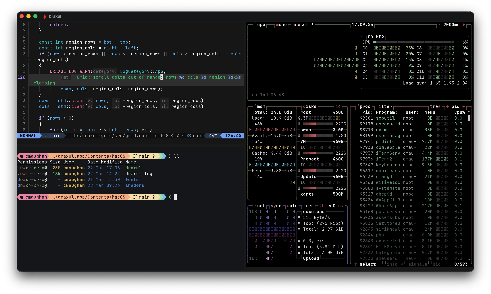
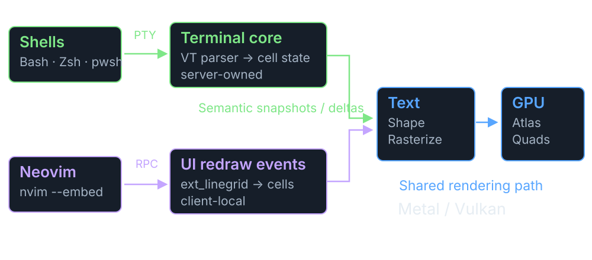
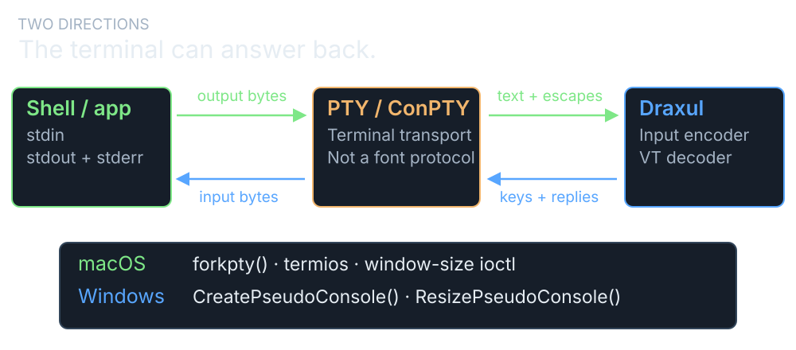
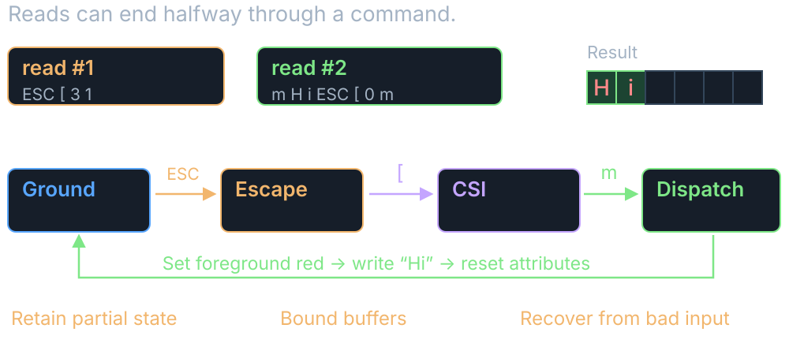
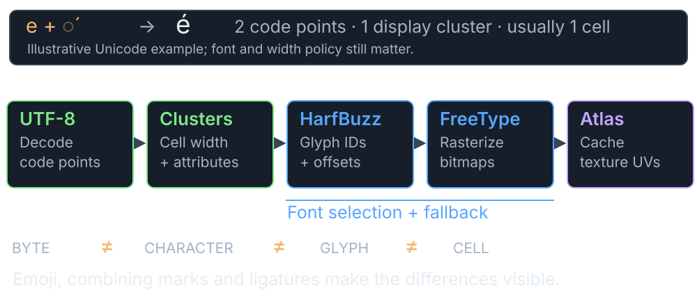
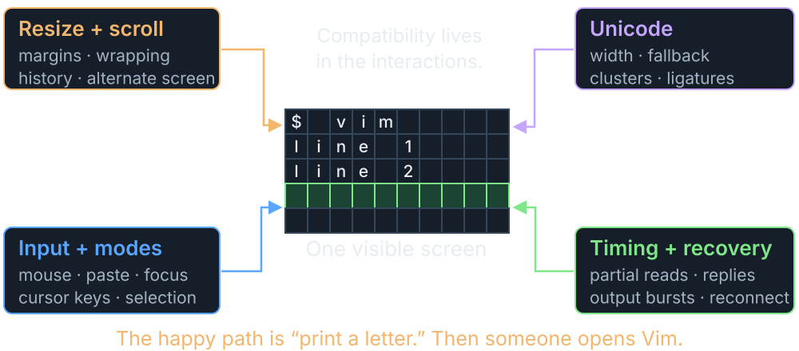
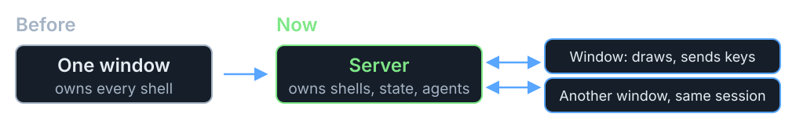
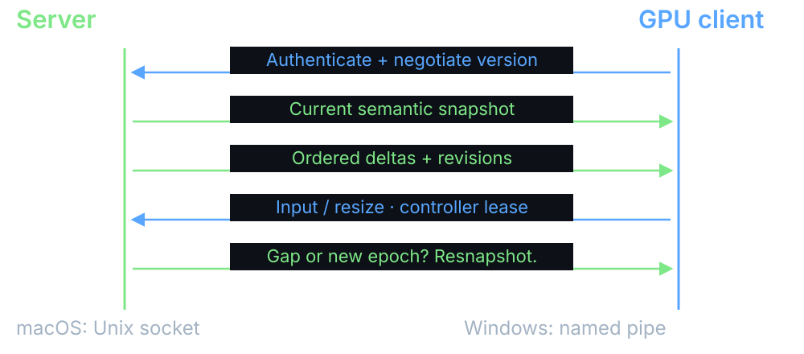
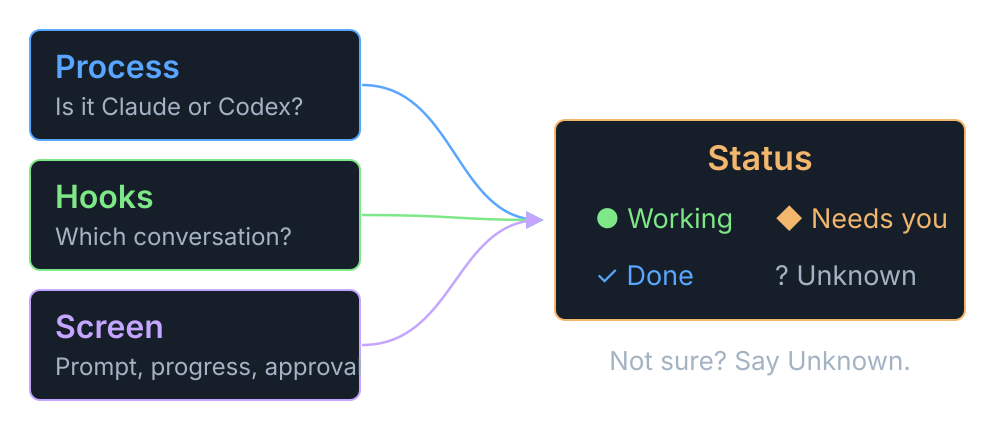
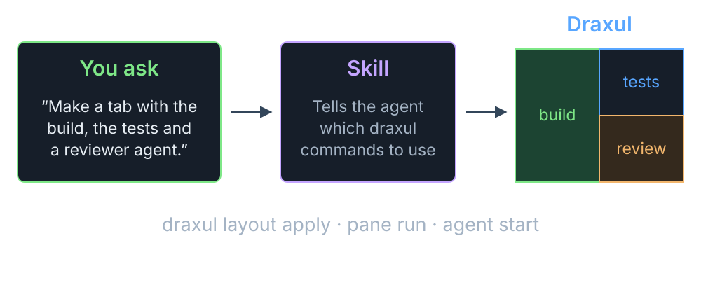

## Building an Agent Friendly Terminal Harness {.title-cover}

```{=html}
<h1>Building an Agent Friendly<br>Terminal Harness</h1>
<p class="cover-meta">Chris Maughan · NVIDIA · Draxul</p>

<div class="cover-bottom"><span>A home for long-running agents</span><span>10 minutes · 3 parts</span></div>
```

::: {.notes}
Draxul started as a GPU frontend for Neovim.  Then it grew a terminal, so I could run shells next to the editor.  Then I started running coding agents in those shells, several at a time, and the interesting problems changed.

The plan: a quick tour of what a terminal actually does, then how Draxul keeps work alive when the window closes, then the agent features, which are the point of the talk.

Implementation reference: Draxul commit `a295e80509c44da3c7b1d6a79468eb60768c587b`.  The cover screenshot predates the agent rail.

Sources: [Draxul source](https://github.com/cmaughan/Draxul/tree/a295e80509c44da3c7b1d6a79468eb60768c587b).
:::

## Which tab was that agent in?

```{=html}
<div class="problem-tabs" aria-label="Six terminal tabs; the visible one shows a build, while a hidden tab has an agent waiting for an answer">
  <div class="tab-strip">
    <span>zsh</span><span>claude</span><span class="current">build</span><span>claude</span><span>codex</span><span>nvim</span>
  </div>
  <pre>[412/418] Linking CXX executable draxul
[418/418] Build complete</pre>
  <div class="meanwhile">Meanwhile, in tab 4, for the last 20 minutes: <code>Apply this change? (y/n)</code></div>
</div>
<p class="takeaway">Agents are slow, patient and quiet.  <strong>They wait for you without saying so.</strong></p>
<div class="part-list">
  <div><span class="blue">1</span> What a terminal does</div>
  <div><span class="green">2</span> Keeping work alive</div>
  <div><span class="orange">3</span> Making agents easy to find and use</div>
</div>
```

::: {.notes}
This is the problem that got me going.  I would have four or five agents running in different tabs.  One of them would stop to ask a question, and I wouldn't notice for twenty minutes.

Agents differ from the usual terminal workload.  They run for a long time, they work in parallel, and they stop to ask for permission.  They also read terminal output themselves, so a terminal can be useful to them as well as to me.

So the goal: keep agents running, show me which one needs me, take me there, and let agents drive the terminal too.
:::

## Part 1: what a terminal does {.section-slide}

<p class="section-sub">The quick version.</p>

## From bytes to pixels

{.deck-visual fig-alt="A shell writes a stream of bytes through the PTY; Draxul parses it into a persistent grid, which the GPU draws using glyphs from a font atlas."}

<p class="takeaway">The stream edits the grid.  <strong>The GPU draws the grid.</strong></p>

::: {.notes}
This is the whole pipeline on one slide.  The shell, or an agent running in it, writes bytes through a PTY on macOS or ConPTY on Windows.  Those bytes are text mixed with instructions: ESC [ 31 m turns red on, H and i are letters, ESC [ 0 m turns it off again, and the carriage return and newline move the cursor.

Draxul's parser reads the stream and turns it into edits on a grid of cells.  Each cell holds a character, its colors and its style.  The cursor, modes and scrollback live alongside it.  This grid is the real state of the terminal, and it's kept by the server, which matters later.

To draw, Draxul looks up each character's shape in a glyph atlas.  HarfBuzz shapes the text, FreeType draws each glyph once, and the result is packed into a texture.  The GPU then paints the frame in two passes: cell backgrounds first, then glyphs from the atlas on top.  It's batched, so there isn't a draw call per character.

Neovim takes a different route in, over msgpack-RPC, because it already knows what its screen looks like.  It ends up in the same grid and renderer.

Sources: [module map](https://github.com/cmaughan/Draxul/blob/a295e80509c44da3c7b1d6a79468eb60768c587b/docs/module-map.md); [GpuCell layout](https://github.com/cmaughan/Draxul/blob/a295e80509c44da3c7b1d6a79468eb60768c587b/libs/draxul-renderer/include/draxul/renderer_state.h).
:::

## A two-way conversation

{.deck-visual fig-alt="Programs send output; the terminal sends keys and replies back."}

<p class="takeaway"><strong>The program talks.  The terminal answers.</strong></p>

::: {.notes}
A pseudoterminal makes the shell believe it's talking to a real terminal, rather than a pipe.  It carries terminal size, signals and line settings as well as text.

It's two-way even when nobody types.  A program can ask "where is the cursor?" with CSI 6 n, and the terminal has to write the answer back.  This becomes important later: if the window is closed, something still has to answer.

Sources: [Apple openpty/forkpty](https://developer.apple.com/library/archive/documentation/System/Conceptual/ManPages_iPhoneOS/man3/openpty.3.html); [Microsoft pseudoconsoles](https://learn.microsoft.com/en-us/windows/console/pseudoconsoles); [Draxul process adapters](https://github.com/cmaughan/Draxul/tree/a295e80509c44da3c7b1d6a79468eb60768c587b/libs/draxul-terminal-process).
:::

## Text comes with instructions

{.deck-visual fig-alt="An incomplete color instruction is completed by the next piece of output, turning Hi red."}

<p class="takeaway"><code>ESC [ 31 m</code> means “make it red”.  <strong>It can arrive half now, half later.</strong></p>

::: {.notes}
Terminal output is text mixed with instructions.  ESC [ 31 m sets the color to red.  There are decades of these, and different terminals support different sets.  Draxul handles 30 CSI endings and 14 private modes, plus a handful of OSC commands.  That's the set real programs needed, not the whole of xterm.

Reads don't line up with instructions.  Here the first read ends after ESC [ 3 1, and the m arrives in the next one.  The parser keeps its state between reads and waits.  UTF-8 characters can split the same way.

The child process controls this input, so every buffer has a limit.

Sources: [parser](https://github.com/cmaughan/Draxul/blob/a295e80509c44da3c7b1d6a79468eb60768c587b/libs/draxul-terminal-core/src/vt_parser.cpp); [CSI/OSC dispatch](https://github.com/cmaughan/Draxul/blob/a295e80509c44da3c7b1d6a79468eb60768c587b/libs/draxul-terminal-core/src/terminal_core_csi.cpp); [xterm control sequences](https://invisible-island.net/xterm/ctlseqs/ctlseqs.html).
:::

## From letters to pixels

{.deck-visual fig-alt="Text is turned into a font shape and drawn in a screen cell."}

<p class="takeaway">One letter on screen can be <strong>more than one character.</strong></p>

::: {.notes}
An e followed by a combining accent is two code points and one cell on screen.  Wide characters, emoji and font fallback all break the one-byte, one-letter idea in different ways.

HarfBuzz shapes the text, FreeType draws the glyph, and Draxul packs it into a texture atlas so it's only drawn once.  The GPU then paints two layers: cell backgrounds, then glyphs from the atlas.  It's batched, so there isn't a draw call per character.

Sources: [text shaping](https://github.com/cmaughan/Draxul/blob/a295e80509c44da3c7b1d6a79468eb60768c587b/libs/draxul-font/src/text_shaper.cpp); [glyph cache](https://github.com/cmaughan/Draxul/blob/a295e80509c44da3c7b1d6a79468eb60768c587b/libs/draxul-font/src/glyph_cache.cpp); [GpuCell layout](https://github.com/cmaughan/Draxul/blob/a295e80509c44da3c7b1d6a79468eb60768c587b/libs/draxul-renderer/include/draxul/renderer_state.h).
:::

## Small things, awkward combinations

{.deck-visual fig-alt="Resize, paste, and emoji can affect the screen together."}

<p class="takeaway">Printing “hello” is easy.  <strong>Then someone resizes the window.</strong></p>

::: {.notes}
The hard bugs come from features that work fine on their own.  Resize during a full-screen redraw.  Paste while an editor is in bracketed-paste mode.  A wide emoji at the right margin.  A query arriving in the middle of a burst of output.

Draxul has tests for a lot of this, and there's still hardening work in the queue.  It's not finished, and I'm not sure a terminal ever is.

Sources: [tests](https://github.com/cmaughan/Draxul/tree/a295e80509c44da3c7b1d6a79468eb60768c587b/tests).
:::

## Part 2: keeping work alive {.section-slide}

<p class="section-sub">Agents run for hours.  Windows don't.</p>

## Close the window.  The work continues

{.deck-visual fig-alt="Draxul moved work out of a single window into a server; windows show the work independently."}

<p class="takeaway">A server owns the shells.  <strong>Windows just show them.</strong></p>

::: {.notes}
This is the same idea as tmux: a server keeps your shells running, and you attach and detach views.  Draxul moved its terminals into a headless server process.

The server owns the PTYs, the terminal state, scrollback, the layout of spaces, tabs and panes, and the agent state.  The window owns fonts, rendering, selection and local focus.  One server can feed several windows.

Remember the two-way conversation?  With no window open, the server still has to answer the program's questions.  That's why the server parses the terminal itself, rather than just recording bytes.

It's not magic.  If the server or the machine restarts, Draxul restores the layout, but it can't bring a dead process back.

Sources: [runtime ownership design](https://github.com/cmaughan/Draxul/blob/a295e80509c44da3c7b1d6a79468eb60768c587b/plans/server-client-terminal-runtime.md).
:::

## Come back to the screen, not a replay

{.deck-visual fig-alt="A returning window asks to reconnect; the server sends the current screen and then subsequent changes."}

<p class="takeaway">Reconnect gets <strong>the current screen, then the changes.</strong></p>

::: {.notes}
Replaying an hour of output to rebuild the screen would be slow, and wrong in places.  Instead the server sends a snapshot of the current screen, then deltas.

Cells, colors, cursor and modes go over the wire.  Fonts and GPU resources stay in the window, so each window can render at its own size and DPI.

If two windows are attached, one has control of input and resize, and the other watches until it takes over.  This all runs over authenticated local IPC: Unix sockets on macOS and named pipes on Windows.

Sources: [runtime ownership design](https://github.com/cmaughan/Draxul/blob/a295e80509c44da3c7b1d6a79468eb60768c587b/plans/server-client-terminal-runtime.md).
:::

## Part 3: agents in the UI {.section-slide}

<p class="section-sub">See them.  Go to them.  Let them drive.</p>

## Every agent in one list

```{=html}
<div class="rail-demo" aria-label="Interactive concept of the Draxul agents rail: click an agent to go to its pane">
  <div class="rail">
    <div class="rail-heading">SPACES</div>
    <div class="rail-space active"><span class="pill"><b>1</b><span>Draxul</span></span></div>
    <div class="rail-space"><span class="pill"><b>2</b><span>Website</span></span></div>
    <div class="rail-divider"></div>
    <div class="rail-heading">AGENTS</div>
    <button class="rail-agent" data-agent="otter" aria-pressed="false"><i class="coin claude fast"></i><span class="pill"><b>1</b><span>happy-otter</span></span></button>
    <button class="rail-agent attention active" data-agent="heron" aria-pressed="true"><i class="coin codex"></i><span class="pill"><b>2</b><span>quiet-heron</span></span></button>
    <button class="rail-agent" data-agent="badger" aria-pressed="false"><i class="coin claude slow"></i><span class="pill"><b>3</b><span>brave-badger</span></span></button>
    <button class="rail-agent exited" data-agent="moth" aria-pressed="false"><i class="coin codex"></i><span class="pill"><b>4</b><span>tidy-moth</span></span> <small>[exited]</small></button>
  </div>
  <div class="rail-pane" aria-live="polite" aria-atomic="true">
    <div class="pane-route" id="agent-route">Draxul › renderer › pane 2</div>
    <div class="pane-status" id="agent-status">◆ Needs you</div>
    <pre id="agent-output">I'd like to run the Metal tests.

Allow this command? (y/n)</pre>
  </div>
</div>
<p class="takeaway">Click a name to <strong>jump to its space, tab and pane.</strong>  The coin spins with its token rate.</p>
<p class="small-note">Clickable mock-up of the real rail · names and output are illustrative</p>
```

::: {.notes}
Click the rows while talking.  This is a mock-up of the real Agents rail, not a live connection.

The rail lists Spaces at the top and agents underneath.  Agents get short generated names like happy-otter, so I can tell them apart in conversation.  Clicking a name activates the owning Space and tab and focuses the pane.  The other agents keep working.

The coin next to each agent is borrowed from TokenFu.  It's blue for Codex and coral for Claude, and it spins faster as the agent burns tokens, then slows to a stop within a minute of going quiet.  The server gets the rate by tailing the agent's own session log.  Only the rate and total cross the wire, never file paths or text.  An agent waiting for me gets a bright accent; an exited one is dimmed and marked.

The rail picks up agents I launch through Draxul, and also ones I start by hand in an ordinary shell.  Launching is in the command palette: pick a Codex or Claude profile, or one from config.toml.

Sources: [Agents rail in features.md](https://github.com/cmaughan/Draxul/blob/a295e80509c44da3c7b1d6a79468eb60768c587b/docs/features.md); [agent model](https://github.com/cmaughan/Draxul/blob/a295e80509c44da3c7b1d6a79468eb60768c587b/libs/draxul-agent/include/draxul/agent_model.h).
:::

## Is it working, or waiting for me?

{.deck-visual fig-alt="Process tracking, hooks and screen rules combine into an agent status, with Unknown when unsure."}

<p class="takeaway">Mostly it reads the screen.  <strong><code>draxul agent explain</code> says why.</strong></p>

::: {.notes}
Three kinds of evidence.  Process tracking spots Claude or Codex starting in a pane, even if I typed the command myself.  On Unix that's the PTY's foreground process group; Windows uses ConPTY job notifications.

Optional hooks, installed with `draxul integration install claude` or `codex`, tell the server which native conversation belongs to which pane.  That gives exact token tracking and lets Draxul resume the right conversation later.

The status itself mostly comes from the bottom of the screen.  Small rule sets for Claude and Codex recognize the idle prompt, progress indicators and approval questions.  The four useful answers are working, blocked, done and idle.  When the rules aren't sure, it says unknown rather than guessing.

These rules will drift when the agents change their UI.  That's why `agent explain` exists: it tells you which rule matched, without exposing the captured text.

The idea of an agent-aware multiplexer came from looking at Herdr, which does this well.  See [herdr.dev](https://herdr.dev/docs/agents/).

Sources: [status rules](https://github.com/cmaughan/Draxul/blob/a295e80509c44da3c7b1d6a79468eb60768c587b/libs/draxul-agent/src/agent_status.cpp); [process discovery](https://github.com/cmaughan/Draxul/blob/a295e80509c44da3c7b1d6a79468eb60768c587b/libs/draxul-agent/src/agent_discovery.cpp).
:::

## Agents can use the terminal too

```{=html}
<div class="communication-examples">
  <div class="command-column">
    <h3>Drive a pane</h3>
    <pre><code><span class="cmt"># find it</span>
draxul pane list --json
<span class="cmt"># run something</span>
draxul pane run P --command "ctest"
<span class="cmt"># wait, then read the result</span>
draxul pane wait-output P --text "passed"
draxul pane read P --lines 40</code></pre>
  </div>
  <div class="command-column">
    <h3>Ask another agent</h3>
    <pre><code><span class="cmt"># start a reviewer</span>
draxul agent start claude --cwd .
<span class="cmt"># give it a job</span>
draxul agent prompt A --text "Review it"
<span class="cmt"># wait until it's done or stuck</span>
draxul agent wait A --until done,blocked</code></pre>
  </div>
</div>
<p class="takeaway">The same commands work for me, a script, <strong>or an agent in another pane.</strong></p>
<p class="small-note">P and A are IDs from the list commands · <code>--current</code> means “this pane”</p>
```

::: {.notes}
Everything in the UI is also available from the `draxul` command line, talking to the server's local control API.  An agent with shell access can run these just like I can.

On the left: list panes, run a command in one, wait for some text to appear, then read the last 40 lines back.  On the right: start a Claude reviewer, give it a prompt (Enter included), and wait until it's done or blocked.

Each pane gets environment variables telling it which session, space, tab and pane it's in, so an agent can say `--current` instead of working out its own ID.

Two honest caveats.  Done means the agent stopped working, not that it succeeded; you still read its pane.  And `pane read` gives you the bottom of the screen, not a structured answer.

There's more: spaces, tabs, splits, swapping and moving panes, and declarative layouts with `draxul layout apply`.

Sources: [CLI help](https://github.com/cmaughan/Draxul/blob/a295e80509c44da3c7b1d6a79468eb60768c587b/libs/draxul-app-cli/src/cli_help.cpp).
:::

## Skills teach agents the commands

{.deck-visual fig-alt="You ask an agent in plain words; a skill tells it which draxul commands to run; the panes appear."}

<p class="takeaway">I describe the layout.  <strong>The agent works out the commands.</strong></p>

::: {.notes}
A skill is a markdown file of instructions that an agent loads when it needs it.  The `draxul` skill in the repository explains how to find the current session, inspect the layout, apply a layout, run panes, start agents, and wait on them properly.  It also covers the traps, such as not blindly retrying a create command that might already have worked.

So I can say "make me a tab with the build on the left, tests top right, and a reviewer agent bottom right", and the agent does it with `layout apply`, `pane run` and `agent start`.

There are a couple of other skills too.  `draxul-review` asks several different AI models to review the repository and combines the results; `draxul-preflight` checks that their command-line tools are installed and logged in.

Right now these skills live in the Draxul repository, so they're picked up when an agent works there.  Packaging them for use anywhere is still to do.

Sources: [draxul skill](https://github.com/cmaughan/Draxul/blob/a295e80509c44da3c7b1d6a79468eb60768c587b/.agents/skills/draxul/SKILL.md); [skills folder](https://github.com/cmaughan/Draxul/tree/a295e80509c44da3c7b1d6a79468eb60768c587b/.agents/skills).
:::

## Personal agents

```{=html}
<div class="personal-agents">
  <div class="pa-rail">
    <div class="rail-heading">PERSONAL AGENTS</div>
    <div class="rail-agent static"><i class="coin codex slow"></i><span class="pill"><b>1</b><span>notes</span></span></div>
    <div class="rail-agent static"><i class="coin claude"></i><span class="pill"><b>2</b><span>reading-list</span></span></div>
    <div class="rail-agent static"><i class="coin codex"></i><span class="pill"><b>3</b><span>house</span></span></div>
    <div class="pa-add">+</div>
  </div>
  <ul class="plain-list">
    <li>A normal Claude or Codex chat <strong>with its own folder</strong></li>
    <li>The folder lives in Dropbox, so <strong>every machine sees it</strong></li>
    <li>Click to pick up where I left off</li>
    <li>Closing the window doesn't stop it</li>
  </ul>
</div>
<p class="takeaway">Conversations that belong to me, <strong>not to a project.</strong></p>
```

::: {.notes}
This is the newest part, and it's changed shape a few times already.  A personal agent is just an ordinary Codex or Claude conversation with a persistent backing folder.  Press plus, chat in the terminal, and it's there next time.

The folders sit under a shared Dropbox path, set with `[agents].personal_root` in config.toml, so the same agents show up on my Mac and my PC.  Click a pill to return to the conversation; if its terminal has gone, it starts a new one with the same folder.  Deleting moves the folder somewhere recoverable rather than destroying it.

Earlier versions had a definition form and a separate run step.  I took that out; a conversation turned out to be simpler.

Sources: [personal agents documentation](https://github.com/cmaughan/Draxul/blob/a295e80509c44da3c7b1d6a79468eb60768c587b/docs/personal-assistant.md).
:::

## Keeping it sensible

```{=html}
<div class="safety-grid">
  <div><h3>Local only</h3><p>Unix socket or named pipe.  A per-user token on every request.</p></div>
  <div><h3>No text by default</h3><p>Status updates never include screen text.  Reading a pane is an explicit, size-limited request.</p></div>
  <div><h3>Ask before destroying</h3><p>Shutting down the server or deleting a session needs <code>--yes</code>.</p></div>
  <div><h3>Still powerful</h3><p>An agent that can type into panes can do what you can.  Keep an eye on it.</p></div>
</div>
```

::: {.notes}
Letting agents type into other agents' terminals raises obvious questions.

The control API only listens locally, on a Unix-domain socket or a Windows named pipe, and every request has to carry a token that only the current user can read.  Windows pipes refuse remote clients.

Agent status events never carry terminal text.  Text only comes back from an explicit `pane read` or `wait-output`, and those are bounded.

Destructive commands like shutting down the server need `--yes`, and the skill tells agents to check with the user first.

None of this protects you from an agent you've told to do something silly.  If an agent can type into a shell, it can do what you can.  Same as any other agent setup.

Sources: [control codec](https://github.com/cmaughan/Draxul/blob/a295e80509c44da3c7b1d6a79468eb60768c587b/libs/draxul-control/src/control_codec.cpp).
:::

## What I learned, and what's next

```{=html}
<div class="wrap-grid">
  <div>
    <h3>Learned</h3>
    <ul class="plain-list">
      <li>A terminal is a <strong>conversation</strong>, not a log</li>
      <li>Keep the work in a <strong>server</strong>; windows come and go</li>
      <li>Status is a guess, so <strong>show your working</strong></li>
      <li>Give agents the <strong>same commands</strong> as people</li>
    </ul>
  </div>
  <div>
    <h3>Next</h3>
    <ul class="plain-list">
      <li>Read the last command's output using shell prompt marks</li>
      <li>Messages between agents that survive restarts</li>
      <li>Skills that work outside the Draxul repo</li>
    </ul>
  </div>
</div>
<p class="takeaway"><strong>github.com/cmaughan/Draxul</strong></p>
```

::: {.notes}
The main lessons.  Treat the terminal as a live, two-way conversation, which pushes you towards parsing it in a server rather than recording bytes.  Once the server owns the work, windows become cheap.  Agent status will always be partly heuristic, so make it explainable and allow unknown.  And the simplest way to let agents coordinate is to give them the same command line I use.

Next: Draxul already parses OSC 133 shell prompt marks, but nothing uses them yet.  They would let `pane read` return just the last command's output instead of the bottom 40 lines.  A persistent mailbox between agents is planned.  And the skills need packaging so they work outside the repository.

Thanks.
:::
