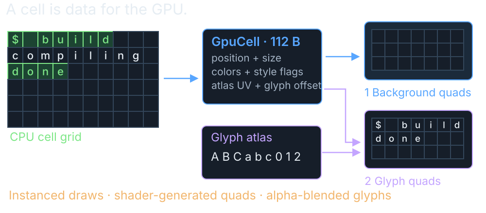
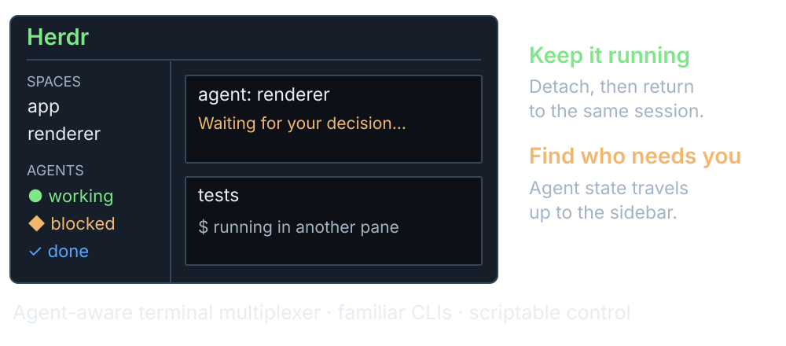

## Building an Agent Friendly Terminal Harness {.title-cover}

```{=html}
<h1>Building an Agent Friendly<br>Terminal Harness</h1>
<p class="cover-meta">Chris Maughan · NVIDIA · Draxul</p>

<div class="cover-bottom"><span>A home for long-running agents</span></div>
```

::: {.notes}
I started with a GPU frontend for Neovim.  Hosting shells adds another route into the same rendering machinery, and hosting agents adds another set of lifetime and attention problems.

This is a tour of the terminal substrate first, then the move to persistent sessions and an agent-aware interface.

Implementation reference: Draxul commit `1c369209b5d65cd41226047a18355fffeeee8a8c`.  Historical screenshots may predate the current agent sidebar.

Sources: [Draxul source](https://github.com/cmaughan/Draxul/tree/1c369209b5d65cd41226047a18355fffeeee8a8c); screenshot from `screenshots/terminals_mac_2.png` in the same repository.
:::

## Draxul turns updates into a screen

{.deck-visual fig-alt="Shell and Neovim updates reach Draxul and a GPU-drawn screen."}

<p class="takeaway">Two ways in.  <strong>One way to draw the result.</strong></p>

::: {.notes}
The shell path is PTY on macOS and ConPTY on Windows.  Draxul's terminal core decodes the stream into cell contents, attributes, modes, and cursor state.  In the current architecture the server owns that terminal state; the UI receives semantic snapshots and deltas.

Embedded Neovim follows a different path: msgpack-RPC and ext_linegrid redraw events.  It already knows its screen layout.  That integration remains client-local, even when its pane is represented in shared topology.

Both paths reach the grid/text/rendering infrastructure.  The renderer sees geometry, colors, atlas coordinates, and flags.  It does not need to understand Bash, PowerShell, VT syntax, or Neovim RPC.

Sources: [module map](https://github.com/cmaughan/Draxul/blob/1c369209b5d65cd41226047a18355fffeeee8a8c/docs/module-map.md); [runtime ownership design](https://github.com/cmaughan/Draxul/blob/1c369209b5d65cd41226047a18355fffeeee8a8c/plans/server-client-terminal-runtime.md).
:::

## Terminal protocols: transport + byte stream

```{=html}
<div class="terminal-transports">
  <div><h3>macOS · PTY</h3><p><code>openpty()</code> + <code>fork()</code> · master/slave<br><code>termios</code>: echo, input, and signals</p></div>
  <div><h3>Windows · ConPTY</h3><p><code>CreatePseudoConsole()</code> · I/O pipes<br>UTF-8 + VT at the host boundary</p></div>
</div>
<p class="terminal-stream">On the wire: <strong>UTF-8 text + C0 controls + VT/ANSI escape sequences</strong></p>
<table class="terminal-protocol-table">
  <thead><tr><th>Direction</th><th>Bytes exchanged</th><th>Meaning</th></tr></thead>
  <tbody>
    <tr><td>App → terminal</td><td><code>\x1b[12;40H</code></td><td>CSI: cursor to row 12, column 40</td></tr>
    <tr><td>App → terminal</td><td><code>\x1b]2;Build\x07</code></td><td>OSC: window title “Build”</td></tr>
    <tr><td>Terminal → app</td><td><code>\x1b[A</code></td><td>Up arrow in normal cursor-key mode</td></tr>
    <tr><td>Query ↔ reply</td><td><code>\x1b[6n</code> → <code>\x1b[12;40R</code></td><td>Ask for / report cursor position</td></tr>
  </tbody>
</table>
<p class="takeaway"><strong>Both sides keep state.</strong>  Modes change how bytes are interpreted.</p>
<p class="small-note">\x1b = ESC (0x1B) · \x07 = BEL · C0 includes CR and LF · resize uses OS APIs</p>
```

::: {.notes}
A pseudoterminal provides the operating-system connection and terminal behavior.  VT/ANSI-style control sequences are the language carried over that connection.  Bash and PowerShell are programs using it, not separate terminal protocols.  Unix PTYs carry bytes without imposing a character encoding; UTF-8 here describes the modern terminal text stream Draxul expects.  ConPTY explicitly uses UTF-8/VT at its host boundary and can translate legacy Windows console operations.

On macOS, Draxul uses openpty, fork, setsid, TIOCSCTTY, and dup2 to attach the child to its controlling terminal.  The master side belongs to Draxul; the child uses the slave.  termios settings govern canonical versus raw input, echo, and control-character handling.  On Windows, CreatePseudoConsole connects the pseudoconsole to input/output pipes.  Draxul resizes with TIOCSWINSZ on Unix and ResizePseudoConsole on Windows, outside the VT byte stream.

The table uses escaped notation: each `\x1b` represents one ESC byte, not four printable characters.  CSI is Control Sequence Introducer (ESC followed by `[`).  OSC is Operating System Command (ESC followed by `]`); the example ends with BEL.  Cursor coordinates are one-based; the example assumes normal origin mode.  The position reply is sent by the terminal in response to the application's query.

Up is ESC [ A in normal cursor-key mode, but ESC O A in application cursor-key mode.  Other modes affect mouse input, focus events, and bracketed paste.  Text and control sequences share an ordered byte stream without message boundaries; a read can end inside either a sequence or a UTF-8 code point.  The following slides expand the command families and parser behavior.

Sources: [Apple openpty/forkpty](https://developer.apple.com/library/archive/documentation/System/Conceptual/ManPages_iPhoneOS/man3/openpty.3.html); [Microsoft pseudoconsoles](https://learn.microsoft.com/en-us/windows/console/pseudoconsoles); [Microsoft VT sequences](https://learn.microsoft.com/en-us/windows/console/console-virtual-terminal-sequences); [xterm control sequences](https://invisible-island.net/xterm/ctlseqs/ctlseqs.html); [Draxul process adapters](https://github.com/cmaughan/Draxul/tree/a295e80509c44da3c7b1d6a79468eb60768c587b/libs/draxul-terminal-process).
:::

## Text comes with instructions

```{=html}
<div class="simple-command" aria-label="ESC bracket 31 m sets the text color to red">
  <div><code>ESC [ 31 m</code><span>“Make the next letters red”</span></div>
  <div class="command-arrow" aria-hidden="true">→</div>
  <div class="red-result">Hi</div>
</div>
<p class="takeaway">Decades of additions.  <strong>Different terminals support different instructions.</strong></p>
<p class="small-note">Draxul: 30 CSI endings + 14 private modes.  More behavior hides in their parameters.</p>
```

::: {.notes}
The example on screen, ESC [ 31 m, sets the foreground color to red.  There is no useful universal answer to “how many terminal opcodes do I need?”  A final byte does not identify an operation on its own.  Private markers, intermediate bytes, parameter values, and existing modes all matter.  SGR alone uses the same final m for resets, styles, indexed colors, and RGB colors.

In the inspected code, handle_csi dispatches 30 distinct final characters.  csi_mode handles 14 distinct DEC private-mode numbers, including three alternate-screen aliases.  Those are not 44 independent commands.  There are also six recognized OSC selectors—0, 2, 7, 8, 52, and 133—plus C0/ESC handling.  The DCS path recognizes XTGETTCAP queries and returns an unsupported response rather than leaving a caller waiting.

The practical target is the applications you need: a shell prompt, a full-screen editor, terminal agents, and multiplexers exercise different subsets.  TERM/terminfo and device replies advertise capabilities; they do not magically implement them.  In xterm, 1049 includes save/restore and alternate-screen behavior; Draxul currently routes 47, 1047, and 1049 through shared alternate-screen handling.

Sources: [Draxul CSI/OSC/DCS dispatch](https://github.com/cmaughan/Draxul/blob/1c369209b5d65cd41226047a18355fffeeee8a8c/libs/draxul-terminal-core/src/terminal_core_csi.cpp); [xterm control sequences](https://invisible-island.net/xterm/ctlseqs/ctlseqs.html); [Microsoft VT sequences](https://learn.microsoft.com/en-us/windows/console/console-virtual-terminal-sequences).
:::

## Wait for the whole instruction

{.deck-visual fig-alt="An incomplete color instruction is completed by the next piece of output."}

<p class="takeaway">A message can arrive <strong>half now, half later.</strong></p>

::: {.notes}
Here the first read ends after ESC [ 3 1.  There is no complete command yet.  The next read begins with m, completing the foreground-red command.  H and i become cell content under the current attributes.  A later ESC [ 0 m can reset the attributes for subsequent text.

The diagram shows the two arriving pieces and the result.  Internally, Draxul retains its parser state between reads.  Draxul's parser has nine enum states covering ground, escape, CSI, OSC, DCS, string termination, and ignored overlong DCS data.  Printable text has a separate UTF-8/cluster path.  UTF-8 code points can also straddle read boundaries.

The parser dispatches callbacks; TerminalCore owns the terminal behavior.  Buffers are capped: CSI at 4 KiB, OSC and DCS at 8 KiB, and plain-text accumulation at 64 KiB.  Bounds and recovery matter because the child process controls this input.  Cross-read grapheme-cluster handling still has tracked hardening work; do not interpret the simplified picture as full Unicode conformance.

Sources: [parser contract](https://github.com/cmaughan/Draxul/blob/1c369209b5d65cd41226047a18355fffeeee8a8c/libs/draxul-terminal-core/include/draxul/vt_parser.h); [parser implementation](https://github.com/cmaughan/Draxul/blob/1c369209b5d65cd41226047a18355fffeeee8a8c/libs/draxul-terminal-core/src/vt_parser.cpp).
:::

## How text becomes a letter on screen

{.deck-visual fig-alt="Text is turned into a font shape and drawn in a screen cell."}

<p class="takeaway">A letter can be made from <strong>more than one character.</strong></p>

::: {.notes}
An ASCII letter makes this look trivial.  An e followed by a combining acute accent is two code points but can occupy one display cluster and one terminal cell.  Wide characters, emoji sequences, font fallback, and programming ligatures break the one-byte/one-character/one-glyph intuition in different ways.

Draxul decodes and stores display text with grid attributes.  Font selection and fallback choose the face.  HarfBuzz returns glyph IDs and offsets; FreeType produces glyph bitmaps; the cache packs reusable pixels into the atlas.  The grid still constrains placement.  The pipeline diagram compresses several collaborating classes and cache checks into their conceptual stages.

The renderer ultimately gets texture coordinates and dimensions, not a Unicode character that the GPU magically understands.  Some box-drawing glyphs also have a dedicated path so adjoining cells meet cleanly.

Sources: [text shaping](https://github.com/cmaughan/Draxul/blob/1c369209b5d65cd41226047a18355fffeeee8a8c/libs/draxul-font/src/text_shaper.cpp); [glyph cache](https://github.com/cmaughan/Draxul/blob/1c369209b5d65cd41226047a18355fffeeee8a8c/libs/draxul-font/src/glyph_cache.cpp); [font service](https://github.com/cmaughan/Draxul/tree/1c369209b5d65cd41226047a18355fffeeee8a8c/libs/draxul-font).
:::

## The GPU paints two layers

{.deck-visual fig-alt="Background cells and letter shapes combine to form the screen."}

<p class="takeaway"><strong>Two layers make the picture.</strong></p>

::: {.notes}
Each GpuCell record is 112 bytes in the inspected implementation, with a compile-time size assertion.  It carries pixel position, cell size, background/foreground/special colors, atlas UVs, glyph offset/size, and style flags.

The vertex shader generates quad geometry using instance and vertex indices.  The first grid draw paints cell backgrounds.  The second paints glyphs from the atlas with alpha blending.  Draxul batches grid work; it does not issue a draw call for every character.

Metal uses shared buffers on macOS; Vulkan uses host-visible memory on Windows.  Atlas uploads, buffer synchronization, pane clipping, cursor overlays, and UI rendering still need management.  The picture shows the two drawing layers; the implementation uses an atlas of cached letter shapes.

Sources: [GpuCell layout](https://github.com/cmaughan/Draxul/blob/1c369209b5d65cd41226047a18355fffeeee8a8c/libs/draxul-renderer/include/draxul/renderer_state.h); [Metal draw path](https://github.com/cmaughan/Draxul/blob/1c369209b5d65cd41226047a18355fffeeee8a8c/libs/draxul-renderer/src/metal/metal_renderer.mm); [Vulkan renderer](https://github.com/cmaughan/Draxul/blob/1c369209b5d65cd41226047a18355fffeeee8a8c/libs/draxul-renderer/src/vulkan/vk_renderer.cpp).
:::

## Small actions, awkward combinations

{.deck-visual fig-alt="Resize, paste, and emoji can affect the screen together."}

<p class="takeaway">Printing “hello” is easy.  <strong>Then someone resizes the window.</strong></p>

::: {.notes}
The hard bugs often combine features that work separately.  Resize during a full-screen redraw.  Paste while bracketed-paste mode is enabled.  Move between normal and alternate screens.  Put a wide cluster at the right margin.  Let a reply-generating query arrive in the middle of a burst.

Terminal modes persist until changed.  Scroll margins, pending wrap, cursor visibility, mouse coordinates, and selection all need coherent behavior.  An application can also hide the cursor during an update or request synchronized output.

Draxul's tests cover partial VT sequences, SGR, OSC/ESC, mouse input, PSReadLine behavior, terminal snapshots, atlas resets, and transport behavior.  The repository still tracks hardening and performance work.  The point is to communicate the interaction surface, not claim the terminal is finished.

Sources: [terminal core](https://github.com/cmaughan/Draxul/tree/1c369209b5d65cd41226047a18355fffeeee8a8c/libs/draxul-terminal-core); [tests](https://github.com/cmaughan/Draxul/tree/1c369209b5d65cd41226047a18355fffeeee8a8c/tests); [active work](https://github.com/cmaughan/Draxul/tree/1c369209b5d65cd41226047a18355fffeeee8a8c/kanban/pending).
:::

## Herdr helps you find the waiting agent

{.deck-visual fig-alt="Herdr shows agents working, waiting for help, or finished."}

<p class="takeaway"><strong>Less hunting through panes.</strong></p>
<p class="small-note">Concept diagram · <a href="https://herdr.dev">herdr.dev</a></p>

::: {.notes}
Herdr is an agent-aware terminal multiplexer/runtime.  It groups work into spaces, tabs, and panes, recognizes agent processes, and exposes working, blocked, done, idle, or unknown states.  Its CLI and local control API let scripts and agents operate the environment as well as humans.

The useful design idea for Draxul is combining process persistence with attention: tell me which agent needs a response, then take me to its pane.  That explains the appeal without needing a popularity claim or a feature-count contest.

State recognition combines process identity with integrations and terminal-screen rules.  Complete lifecycle hooks can be authoritative; a native conversation/session ID alone does not prove whether an agent is working.  Screen heuristics can drift, so unknown and explainable evidence matter.

This is a conceptual interface diagram, not a Herdr screenshot or a claim that Draxul runs Herdr internally.  The project is motionharvest/herdr, also identified by Draxul's existing research notes.

Sources: [Herdr documentation](https://herdr.dev/docs/); [agent detection and state](https://herdr.dev/docs/agents/); [Draxul's Herdr research](https://github.com/cmaughan/Draxul/blob/1c369209b5d65cd41226047a18355fffeeee8a8c/plans/herdr-agent-harness-research.md).
:::

## Click the agent.  Go to its work

```{=html}
<div class="agent-demo" aria-label="Interactive concept: click an agent to go to its work">
  <div class="agent-list">
    <div class="demo-heading">YOUR AGENTS</div>
    <button class="agent-row" data-agent="build" aria-pressed="false"><span class="green">●</span> Build the app<small>Working</small></button>
    <button class="agent-row active" data-agent="review" aria-pressed="true"><span class="orange">◆</span> Review changes<small>Needs you</small></button>
    <button class="agent-row" data-agent="tests" aria-pressed="false"><span class="blue">✓</span> Check reconnect<small>Finished</small></button>
    <button class="agent-row" data-agent="new" aria-pressed="false"><span class="purple">○</span> Start a task<small>Just created</small></button>
  </div>
  <div class="agent-pane" aria-live="polite" aria-atomic="true">
    <div class="demo-route" id="agent-route">Protocol</div>
    <h3 id="agent-title">Review changes</h3>
    <div class="demo-status" id="agent-status">Needs your decision</div>
    <pre id="agent-output">I found a possible problem.

Shall I investigate it?</pre>
  </div>
</div>
<p class="takeaway"><strong>Go straight to whoever needs you.</strong>  The others keep working.</p>
<p class="small-note">Clickable concept · illustrative tasks</p>
```

::: {.notes}
Click the four rows during the presentation.  The panel demonstrates navigating to the owning Space, Tab, and Pane without restarting work.  The task names and terminal output are illustrative; this is not a live Draxul connection.

Draxul separates durable identity from runtime lifecycle and semantic status.  Lifecycle is Starting, Running, Exited, or Failed.  Semantic status is Unknown, Idle, Working, Blocked, or Done.  “Just created” in this illustration is the user's creation event, represented by Starting; it is not an extra enum state.  A Running agent can be blocked on a decision or done with its latest task while the process stays alive.

Managed agents are launched intentionally; discovered agents may have been started by hand in an ordinary shell pane.  Both need stable identity and a route to their owner.  The sidebar is a projection of authoritative state, not a second independent registry.  Process discovery, screen evidence, and integrations contribute different kinds of evidence.

AgentController already provides identity-based and index-based focus operations.  The route activates the Space and Tab and focuses the owning pane.  Local navigation must not drag another UI client to the same pane.  The design goal is to spend less time looking for the waiting agent.

Sources: [agent identity, lifecycle and status model](https://github.com/cmaughan/Draxul/blob/1c369209b5d65cd41226047a18355fffeeee8a8c/libs/draxul-agent/include/draxul/agent_model.h); [agent controller and focus routing](https://github.com/cmaughan/Draxul/blob/1c369209b5d65cd41226047a18355fffeeee8a8c/app/agent_controller.cpp); [agent UI design](https://github.com/cmaughan/Draxul/blob/1c369209b5d65cd41226047a18355fffeeee8a8c/plans/agent-cards-token-activity.md).
:::

## Commands between panes and agents

```{=html}
<div class="communication-examples">
  <div class="command-column">
    <h3>Pane → pane</h3>
    <p>Find the destination</p>
    <pre><code>draxul pane list --json</code></pre>
    <p>Type into another pane, then press Enter</p>
    <pre><code>draxul pane send P --text "ctest"
draxul pane keys P Enter</code></pre>
    <p>Read back what appeared</p>
    <pre><code>draxul pane read P --lines 40</code></pre>
  </div>
  <div class="command-column">
    <h3>Agent → agent</h3>
    <p>Find the other agent</p>
    <pre><code>draxul agent list --json</code></pre>
    <p>Give it a task — Enter included</p>
    <pre><code>draxul agent prompt A --text "Review this"</code></pre>
    <p>Wait until it finishes or needs help</p>
    <pre><code>draxul agent wait A --until done,blocked</code></pre>
  </div>
</div>
<p class="takeaway">An agent can <strong>drive another pane or ask another agent to work.</strong></p>
<p class="small-note">P = pane ID · A = agent ID · use IDs returned by the list commands</p>
```

::: {.notes}
These are Draxul's existing command-line controls, backed by its local control API.  An agent with shell access can invoke them just as a person or script can.  Replace P with a pane ID from `draxul pane list --json`, and A with an agent instance ID from `draxul agent list --json`.

The left example sends literal text to another pane, then sends Enter as a separate operation.  The example assumes the target pane is at a shell prompt where `ctest` is an appropriate command.  `pane send` and `pane keys` send input to whatever program currently owns that terminal; they do not automatically find a shell.  `pane run P --command "ctest"` offers the combined command-submission form.  The read returns the last 40 terminal lines.

The right example addresses an agent by its stable instance ID instead of manually finding its pane.  `agent prompt` includes Enter in the same request.  The wait returns when the agent is done or blocked; a blocked agent needs attention, while done is an observed status rather than a guarantee that the requested task succeeded.  Read its owning pane to inspect output.  These are terminal-based coordination commands; the persistent agent mailbox is a separate planned feature.

Find: `draxul agent list --json` discovers agents; `draxul agent get <id> --json` gives one agent's identity, route, lifecycle, and semantic status.  The underlying methods are `agent.list` and `agent.get`.  `agent explain` provides the evidence behind a reported state.

Give work: `draxul agent start <profile-id> --cwd <path>` launches a configured agent profile through `agent.start`.  `draxul agent prompt <id> --text "Run the tests"` sends text and Enter together through `agent.send_text`.  `agent send` uses the same API without Enter, while `agent keys` sends named keys through `agent.send_keys`.

Follow: `draxul agent wait <id> --until <state,state> --timeout <duration> --json` waits for a requested state through `agent.wait`.  State describes activity; it does not prove the task succeeded.  Terminal text is read separately with `draxul pane read <pane-id> --lines 40 --json`, using the agent's owning pane ID.  This maps to `pane.read` and returns a bounded terminal-text view, not a structured answer or complete conversation history.  `pane wait-output` can wait for matching text.

`agent focus` jumps to the owning pane; `agent restart` restarts the instance.  Session selection is available with `--session`.  The control endpoint is authenticated and local to the user; these commands control the terminal around an agent rather than calling the model provider's API directly.

Sources: [CLI commands](https://github.com/cmaughan/Draxul/blob/1c369209b5d65cd41226047a18355fffeeee8a8c/libs/draxul-app-cli/src/cli_help.cpp); [CLI-to-API mapping and prompt handling](https://github.com/cmaughan/Draxul/blob/1c369209b5d65cd41226047a18355fffeeee8a8c/libs/draxul-app-cli/src/control_cli.cpp).
:::


## Personal assistant agents

<p class="takeaway">Saved instructions for <strong>jobs I want to repeat.</strong></p>

```{=html}
<div class="personal-assistant-overview">
  <div>
    <h3>Set it up</h3>
    <p><strong>1. Choose a shared folder</strong></p>
    <pre><code>[agents]
personal_root = "/path/to/Dropbox/Vault/PA"</code></pre>
    <p><strong>2. Create an agent</strong><br>In Personal Assistant: name, Codex or Claude,<br>model, and instructions.  Preview and save.</p>
    <p><strong>3. Pin one machine, then Run</strong><br>The server runs the job and saves its result.</p>
  </div>
  <div>
    <h3>Give it a standing job</h3>
    <blockquote>“Review my project notes and summarize what needs attention.”</blockquote>
    <p>Save the job once.  Run it again without<br>rewriting the prompt.</p>
    <p>Definitions and summaries sync through Dropbox.<br>Runs keep going after the window closes.</p>
  </div>
</div>
<p class="assistant-status"><strong>Today:</strong> manual, read-only runs · up to 5 minutes<br><span>Planned: schedules, messaging, and handoff between machines</span></p>
```

::: {.notes}
A personal agent is a saved definition with a name, provider profile, explicit model, and standing instructions.  It stays visible in Personal Agents between runs; active executions also appear in Agents.  The project-notes example is an illustrative job, not an already configured agent.  The longer-term intent is repeatable personal work such as reviews, summaries, and periodic checks, with inspectable activity and editable instructions.

Configure `[agents].personal_root` in Draxul's normal config.toml.  The path shown is a placeholder; this machine uses `/Users/cmaughan/Dropbox/Vault/PA`, and Windows should point to the same collection under its own Dropbox folder.  The server reads the setting at startup.  Reopening a GUI alone does not reload it.  The shared folder contains collection.toml, agent manifests and instruction files, plus immutable run inputs and final summaries.  Raw output stays in local application data.

Open the Personal Assistant tab from the command palette or launch `draxul --host personal-assistant`.  N creates a draft; choose a supported Codex or Claude profile, type an explicit model, and write the instructions.  Ctrl+Enter previews the definition and Enter saves it.  Instructions are used verbatim.  The provider executable and authentication must already work locally; there is no silent model fallback.

P previews pinning execution to this machine and Enter confirms.  Keep other machines display-only.  R previews a manual run against the saved revision and Enter starts it.  H opens history; C cancels the selected active run.  The server owns execution, so closing the view or all GUI windows does not cancel a run.  Editing instructions affects the next run.

Current implementation: one run at a time, at most five minutes, with read-only provider tools and bounded output.  This is suitable for inspecting available files and producing summaries; it is not yet an unrestricted personal automation service.  A provider final-result event is required for success.  Scheduling, durable messaging, and coordinated cross-machine handoff remain planned.  Dropbox shares definitions and results; it does not coordinate who may execute.  The machine pin is local and lasts for the server lifetime.

Sources: current local [Personal Assistant documentation](/Users/cmaughan/dev/draxul/docs/personal-assistant.md), [implementation plan](/Users/cmaughan/dev/draxul/plans/personal-assistant.md), and [server execution service](/Users/cmaughan/dev/draxul/libs/draxul-server/src/personal_agent_service.cpp), including in-progress changes inspected October 6, 2026.
:::


## How running agents are discovered

```{=html}
<p class="takeaway">Start <code>codex</code> or <code>claude</code> in a Draxul shell pane.  <strong>Draxul finds it.</strong></p>
<div class="agent-discovery-steps">
  <div><h3>1. Inspect the pane</h3><p><strong>macOS:</strong> PTY foreground process group · <code>tcgetpgrp()</code><br><strong>Windows:</strong> Job Object processes + shell descendants</p></div>
  <div><h3>2. Recognize the agent</h3><p>Match executable names, launch arguments, and known wrappers.<br>Handle <code>node …/codex.js</code>, versioned installs, and agent hints.</p></div>
  <div><h3>3. Add it to Agents</h3><p>The server assigns an instance ID and keeps its pane route.<br>Ambiguous matches are rejected; confidence is recorded.</p></div>
</div>
<p class="discovery-status"><strong>Identity comes from processes.</strong>  Activity comes from terminal titles + screen rules.<br><code>draxul agent list --json</code> · <code>draxul agent explain A</code></p>
<p class="small-note">Agents launched by Draxul already have an identity.  Discovery covers agents started by hand in its panes.</p>
```

::: {.notes}
This slide describes the current server-owned terminal path, inspected at Draxul commit a295e80509c44da3c7b1d6a79468eb60768c587b on October 7, 2026.  Discovery is scoped to Draxul's terminals, not an inventory of every agent on the computer.  Managed launches supply declared_identity; the server reserves those IDs and skips inference for them.

On macOS, capture_unix_agent_processes calls tcgetpgrp on the PTY master.  proc_listpids(PROC_PGRP_ONLY) enumerates that foreground process group; libproc and sysctl collect executable paths, argv, parent PID, working directory, and the optional DRAXUL_AGENT environment hint.  This foreground-group evidence is marked reliable.  Background jobs outside that group are not enumerated by this path.

On Windows, capture_agent_processes first inspects the ConPTY Job Object's process IDs.  If that does not yield an agent, it reconciles descendants of the shell using a Toolhelp process snapshot, covering children outside the job.  Windows observations do not claim reliable foreground selection.  Multiple unrelated candidate processes are rejected, even if they name the same agent kind; a wrapper and its child in one ancestry chain can match together.

The shared discover_agent_process matcher checks environment hints, executable names, argv[0], known versioned installation paths, and structured wrapper arguments.  Recognized kinds are Codex and Claude.  Matching normalizes platform path separators and executable suffixes.  It recognizes known Node/package/shell launch forms rather than treating any mention of an agent in arbitrary command text as proof.  Conflicting kinds produce no match.  high_confidence is also gated on reliable foreground evidence.

AgentProcessObserver performs and caches probes on a worker thread, with activity/change signals and bounded periodic refresh.  The UI does not inspect processes every frame.  ServerAgentService allocates an instance ID, records origin Discovered and identity evidence, and attaches the Space/Tab/Pane/terminal route.  Runtime-generation changes reset discovery state; repeated missing matches remove the discovered identity.

Finding a process identifies the agent, not its current task status.  In this server path, evaluate_agent_observation inspects terminal titles and recent visible rows using bundled Codex/Claude rules, retaining unknown when evidence is insufficient.  Integration hooks can attach native provider session IDs, but those IDs alone do not establish working/blocked/done.  `agent list --json` exposes origin, identity evidence/confidence, and route; `agent explain A` explains status evidence.  Replace A with an actual instance ID.

Sources: [Unix process probe](https://github.com/cmaughan/Draxul/blob/a295e80509c44da3c7b1d6a79468eb60768c587b/libs/draxul-terminal-process/src/unix_agent_process_probe.cpp); [Windows process probe](https://github.com/cmaughan/Draxul/blob/a295e80509c44da3c7b1d6a79468eb60768c587b/libs/draxul-terminal-process/src/conpty_process.cpp); [agent matcher](https://github.com/cmaughan/Draxul/blob/a295e80509c44da3c7b1d6a79468eb60768c587b/libs/draxul-agent/src/agent_discovery.cpp); [server registration](https://github.com/cmaughan/Draxul/blob/a295e80509c44da3c7b1d6a79468eb60768c587b/libs/draxul-server/src/server_agent_service.cpp); [background observer](https://github.com/cmaughan/Draxul/blob/a295e80509c44da3c7b1d6a79468eb60768c587b/libs/draxul-terminal-process/src/agent_process_observer.cpp); [status rules](https://github.com/cmaughan/Draxul/blob/a295e80509c44da3c7b1d6a79468eb60768c587b/libs/draxul-agent/src/agent_status.cpp).
:::
