## Inspiration

```{=html}
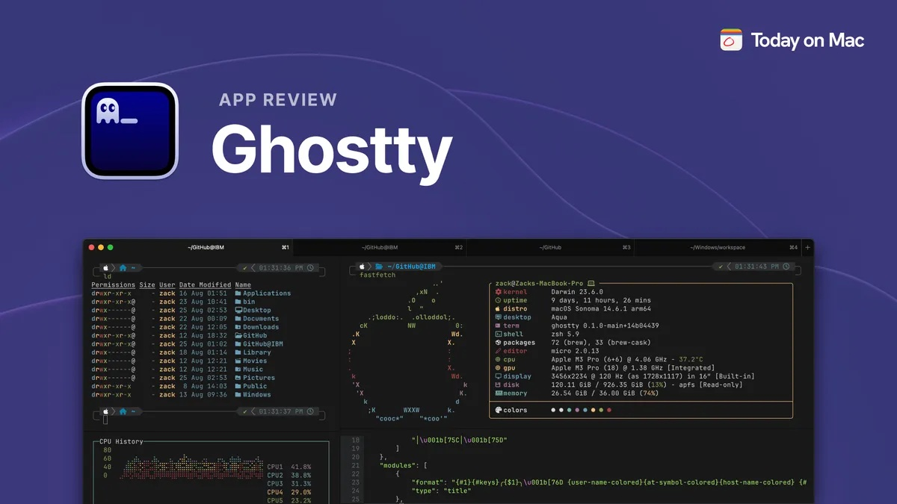
<p class="small-note">Image: <a href="https://www.todayonmac.com/">Today on Mac</a> review of Ghostty</p>
```

::: {.notes}
This was the initial inspiration.  Ghostty is a terminal that draws with the GPU, using Metal on the Mac, and it's fast and good-looking.  It runs on macOS and Linux, but not on Windows.

I wanted that kind of hardware-accelerated terminal on both of my platforms, and I already had a GPU front end for Neovim to build it into.
:::

## Draxul, briefly

```{=html}
<div class="collage collage-2x2">
  <figure>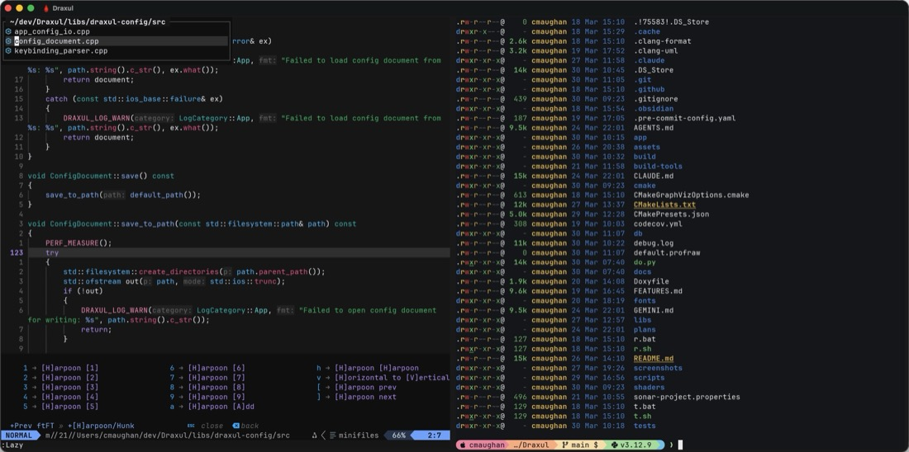<figcaption>GPU-drawn terminals and Neovim</figcaption></figure>
  <figure>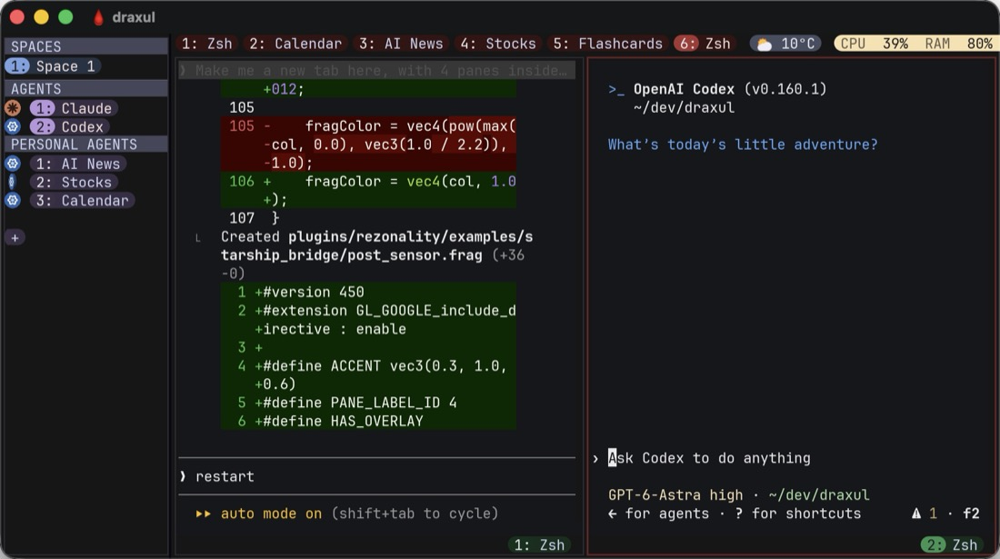<figcaption>Claude and Codex in the agent rail</figcaption></figure>
  <figure>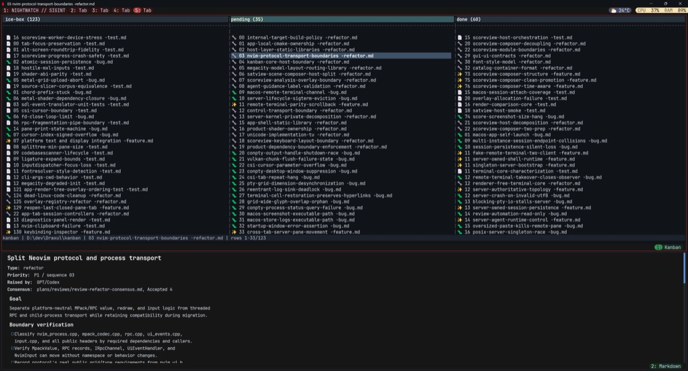<figcaption>A Kanban board for the work queue</figcaption></figure>
  <figure>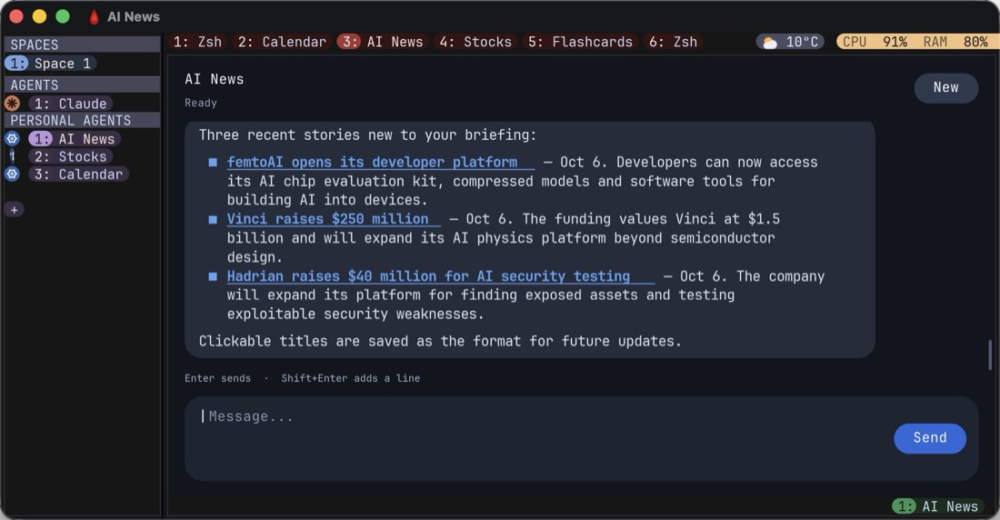<figcaption>A personal agent with its daily briefing</figcaption></figure>
</div>
```

::: {.notes}
Draxul started as a GPU front end for Neovim.  Then it grew a terminal, so I could run shells next to the editor.  Then I started running coding agents in those shells, several at a time, and the interesting problems changed.  It runs on macOS and Windows.

Top left: ordinary terminals and Neovim in split panes.  Top right: the agent rail with Claude and Codex running, and some personal agents underneath.  Bottom left: the Kanban board I use to queue work for agents.  Bottom right: one of the personal agents, which keeps a running AI news brief.

Everything here lives in one window, and the server keeps it running when the window closes.

The background on the title slide is Rezonality's Starship Bridge example, rendered in a Draxul pane.
:::

## Anything that fits in a pane

```{=html}
<div class="collage collage-feature">
  <figure class="feature">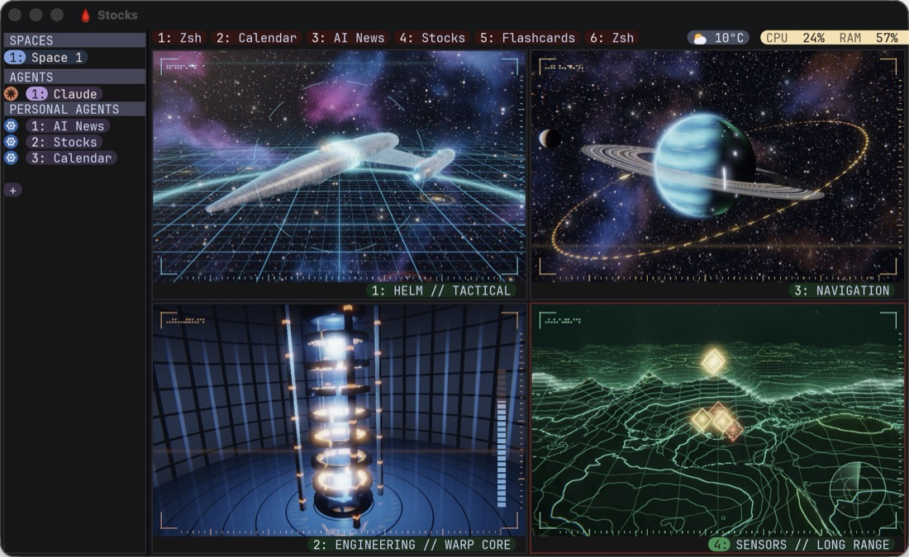<figcaption>Rezonality: four live shader scenes</figcaption></figure>
  <figure>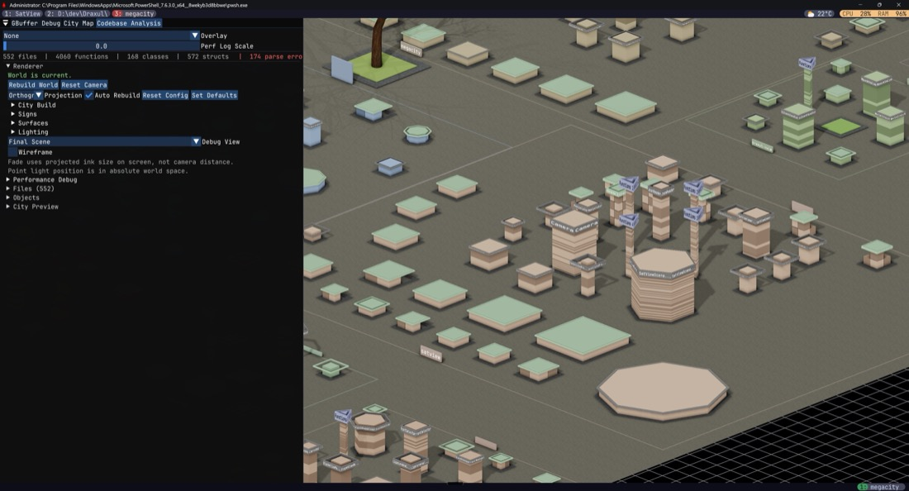<figcaption>MegaCity: a codebase as a city</figcaption></figure>
  <figure>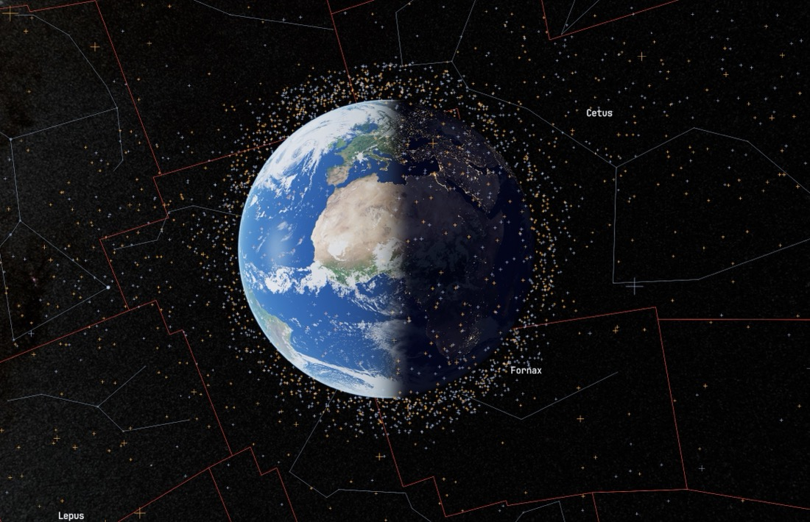<figcaption>SatView: satellites around Earth</figcaption></figure>
  <figure>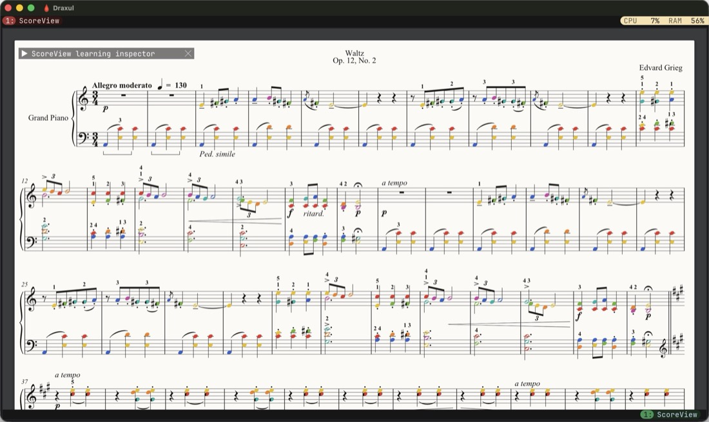<figcaption>ScoreView: a piano practice partner</figcaption></figure>
  <figure>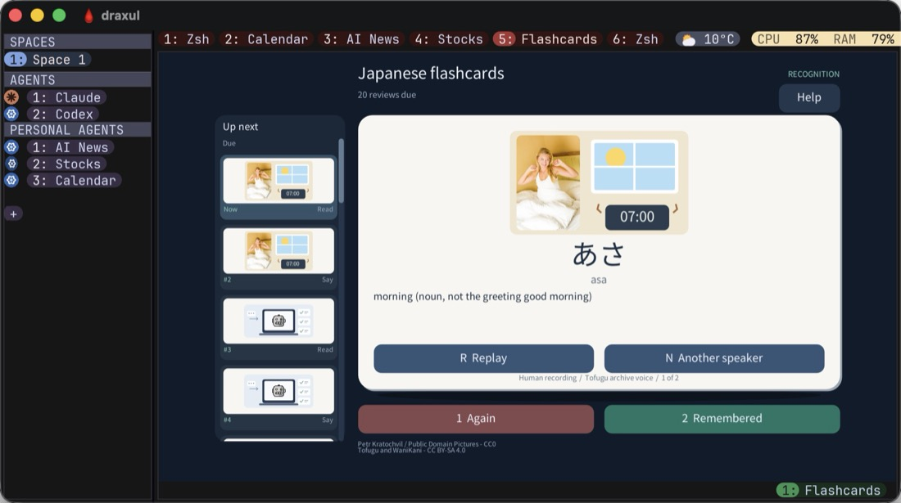<figcaption>Flashcards: Japanese practice</figcaption></figure>
</div>
```

::: {.notes}
Panes don't have to hold text.  These are all native plugins that draw straight into a pane on the same GPU frame as the terminals.

The big one is Rezonality's Starship Bridge example: four live shader scenes sharing an HDR bloom and a HUD.  MegaCity turns a source tree into an explorable 3D city.  SatView draws thousands of satellites around a day-night Earth.  ScoreView is an experimental piano teacher that turns a score into a practice session.  Flashcards is a small Japanese practice plugin.
:::

## Rezonality: a 3D engine in a pane

```{=html}
<div class="rezonality">
  <div class="rz-code">
    <div class="rz-file">deferred_shading/default.scenegraph</div>
<pre><code><span class="kw">surface:</span> Positions { format: rgba16f }
<span class="kw">surface:</span> Albedo    { format: default_color }
<span class="kw">surface:</span> Normals   { format: rgba16f }
<span class="kw">surface:</span> Depth     { format: default_depth }

<span class="kw">pass:</span> GBuffer {
  targets: (Positions, Albedo, Normals, Depth)
  geometry: background {
    path: screen_rect
    vs: screen.vert  fs: gbuffer.frag }
}
<span class="kw">pass:</span> Lights {
  samplers: (Positions, Albedo, Normals)
  targets: (default_color)
  geometry: background { ... fs: lighting.frag }
}</code></pre>
  </div>
  <ol class="rz-steps">
    <li><b>Scene graph</b>Surfaces, cameras, glTF/OBJ models and ordered passes</li>
    <li><b>Shaders</b>GLSL → SPIR-V with glslang → Metal source via SPIRV-Cross</li>
    <li><b>Passes</b>Each pass renders into its surfaces; the last one fills the pane</li>
    <li><b>Live edits</b>Saving rebuilds; a bad edit leaves the last good build on screen</li>
  </ol>
</div>
```

::: {.notes}
Rezonality is a Draxul plugin, and the Draxul version of VkLive, an older live shader tool of mine.  It renders straight into a pane, with Metal on macOS and Vulkan on Windows, while you edit the project from a terminal or editor pane next to it.

A project is a scene graph file plus shaders.  The scene graph declares surfaces (render targets with a format and a scale relative to the pane), cameras, models loaded through Assimp, and an ordered list of passes.  Each pass names the surfaces it writes and the ones it samples.  The example on screen is deferred shading: one pass fills position, albedo and normal targets, and a second pass reads them to light the scene.  Multiple render targets, float formats, depth, bloom chains and HDR environments all fall out of the same few keywords.

Shaders are plain GLSL.  Rezonality compiles them to SPIR-V with glslang.  Vulkan uses that directly; on macOS SPIRV-Cross generates Metal Shading Language from the SPIR-V, with the bindings mapped to match.  On ray-capable GPUs it also builds acceleration structures and runs ray-generation, miss and hit shaders, or the equivalent Metal kernel.

Every save produces a new numbered build.  If it fails, the error goes to the pane's status pill and to a small JSON file, and the previous good build keeps rendering.  That JSON is the important bit for agents: it lists the file, line and message, plus which build is being attempted and which is active.  An agent can break a shader, read the error, fix it, and see the next build go live, without trying to read pixels.

There's a layout generator that sets up an editor pane next to a Rezonality view with one `draxul layout apply`.  Put that together with the Draxul skill (more on that later), and "make me a spinning ringed planet in this pane" turns into a scene graph, a few shaders and a working picture.  How good the picture is depends on the agent, of course.

Sources: [Rezonality README](https://github.com/cmaughan/draxul-rezonality/blob/00c3ae1d325e4737a0adfe9762eba1516678481c/README.md); [agent guide](https://github.com/cmaughan/draxul-rezonality/blob/00c3ae1d325e4737a0adfe9762eba1516678481c/AGENTS.md); [Metal backend](https://github.com/cmaughan/draxul-rezonality/blob/00c3ae1d325e4737a0adfe9762eba1516678481c/src/native_backend_metal.mm); [deferred shading example](https://github.com/cmaughan/draxul-rezonality/blob/00c3ae1d325e4737a0adfe9762eba1516678481c/examples/deferred_shading/default.scenegraph).
:::

## What Rezonality can draw

```{=html}
<div class="collage collage-feature rz-collage">
  <figure class="feature">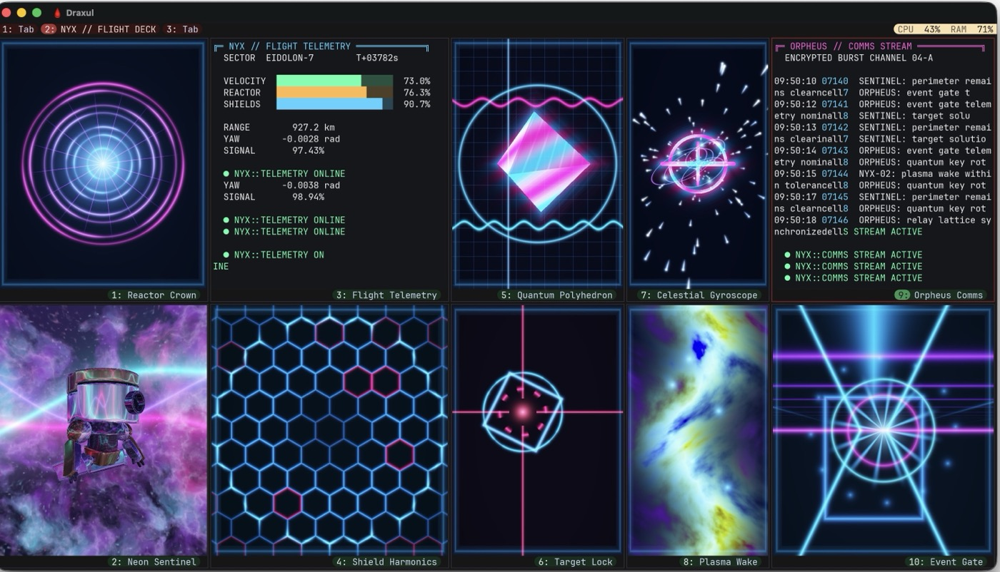<figcaption>A sci-fi dashboard, live-coded by Codex in Draxul</figcaption></figure>
  <figure>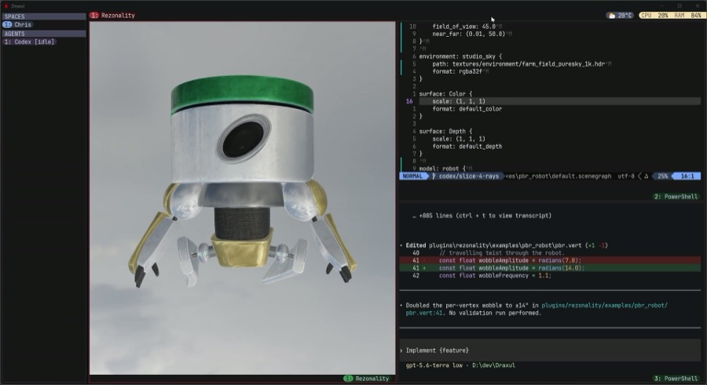<figcaption>Codex editing the PBR robot scene</figcaption></figure>
  <figure>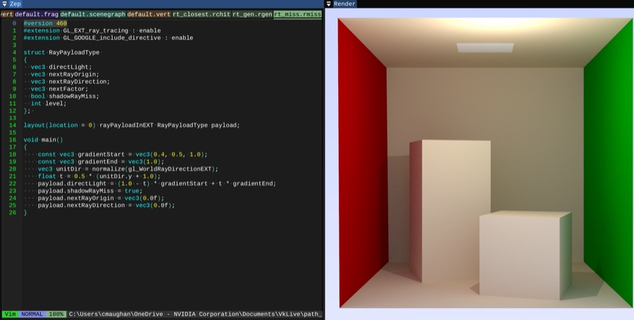<figcaption>Ray-traced Cornell box</figcaption></figure>
  <figure>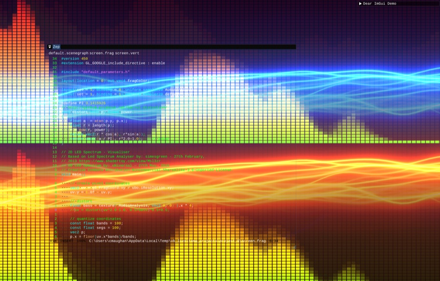<figcaption>Audio-reactive spectrum</figcaption></figure>
  <figure>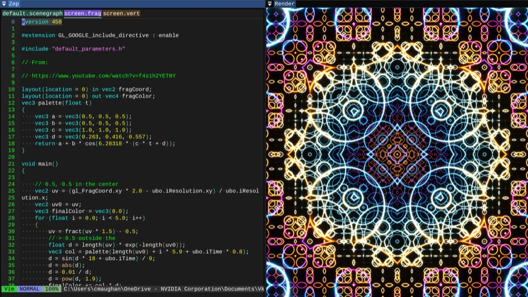<figcaption>Shader art, edited live</figcaption></figure>
</div>
```

::: {.notes}
A few things Rezonality has drawn.  The big one is a sci-fi flight-deck dashboard that I had Codex live-code inside Draxul: ten panes of shader art and telemetry text in one tab.  Next to it, Codex is editing the PBR robot scene graph in one pane while the render updates in the other.

The bottom row is from the earlier standalone Rezonality, with the Zep editor on the left: a ray-traced Cornell box, an audio-reactive spectrum, and some shader art.  The same kinds of project now run as examples in the Draxul plugin.

Sources: [Rezonality portfolio page](https://chrismaughan.com/portfolio/jorvik/).
:::

## One GPU surface, many kinds of panes

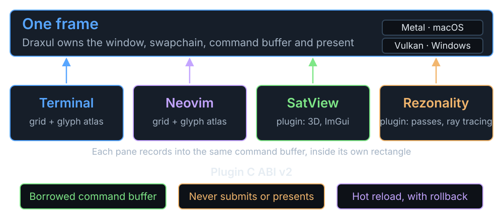{.deck-visual fig-alt="Draxul owns one GPU frame on Metal or Vulkan; terminals, Neovim and plugins each record into the shared command buffer inside their pane."}

::: {.notes}
All of this works because Draxul owns one GPU frame, using Metal on macOS and Vulkan on Windows.  It owns the window, the swapchain or drawable, the frame's command buffer, the glyph atlas and the present.

Each pane records its own work into that command buffer, in pane order, clipped to its rectangle.  Terminal and Neovim panes upload their cell grid and draw it with the glyph atlas.  Plugin panes record whatever they like: SatView and MegaCity run their own HDR scene passes and ImGui, and Rezonality runs its pass list and, on capable GPUs, ray tracing.

Plugins are native DLLs or dylibs behind a small C ABI.  They get a borrowed Vulkan command buffer, or a Metal continuation descriptor, and must leave it as they found it.  They never submit, present or keep host objects.  That keeps one bad plugin from owning the frame.  Plugins can be rebuilt and hot reloaded while Draxul runs; if the new version fails to start, the old one stays.

Ray tracing is optional.  Draxul only turns on the Vulkan ray extensions when the whole set is there, so a plugin that needs it can report "not supported" instead of stopping Draxul from starting.

Sources: [plugin ABI header](https://github.com/cmaughan/Draxul/blob/a295e80509c44da3c7b1d6a79468eb60768c587b/sdk/include/draxul/plugin_api.h); [native GPU pane plugins](https://github.com/cmaughan/Draxul/blob/a295e80509c44da3c7b1d6a79468eb60768c587b/docs/features.md); [rendering flow](https://github.com/cmaughan/Draxul/blob/a295e80509c44da3c7b1d6a79468eb60768c587b/docs/architecture/rendering.md).
:::

## From bytes to pixels

{.deck-visual fig-alt="A shell writes a stream of bytes through the PTY; Draxul parses it into a persistent grid, which the GPU draws using glyphs from a font atlas."}

::: {.notes}
This is the whole pipeline on one slide.  The shell, or an agent running in it, writes bytes through a PTY on macOS or ConPTY on Windows.  Those bytes are text mixed with instructions: ESC [ 31 m turns red on, H and i are letters, ESC [ 0 m turns it off again, and the carriage return and newline move the cursor.

Draxul's parser reads the stream and turns it into edits on a grid of cells.  Each cell holds a character, its colors and its style.  The cursor, modes and scrollback live alongside it.  This grid is the real state of the terminal, and it's kept by the server, which matters later.

To draw, Draxul looks up each character's shape in a glyph atlas.  HarfBuzz shapes the text, FreeType draws each glyph once, and the result is packed into a texture.  The GPU then paints the frame in two passes: cell backgrounds first, then glyphs from the atlas on top.  It's batched, so there isn't a draw call per character.

Neovim takes a different route in, over msgpack-RPC, because it already knows what its screen looks like.  It ends up in the same grid and renderer.

Sources: [module map](https://github.com/cmaughan/Draxul/blob/a295e80509c44da3c7b1d6a79468eb60768c587b/docs/module-map.md); [GpuCell layout](https://github.com/cmaughan/Draxul/blob/a295e80509c44da3c7b1d6a79468eb60768c587b/libs/draxul-renderer/include/draxul/renderer_state.h).
:::

## Text comes with instructions

{.deck-visual fig-alt="An incomplete color instruction is completed by the next piece of output, turning Hi red."}

::: {.notes}
Terminal output is text mixed with instructions.  ESC [ 31 m sets the color to red.  There are decades of these, and different terminals support different sets.  Draxul handles 30 CSI endings and 14 private modes, plus a handful of OSC commands.  That's the set real programs need, not the whole of xterm.

Reads don't line up with instructions.  Here the first read ends after ESC [ 3 1, and the m arrives in the next one.  The parser keeps its state between reads and waits.  UTF-8 characters can split the same way.

The child process controls this input, so every buffer has a limit.

Sources: [parser](https://github.com/cmaughan/Draxul/blob/a295e80509c44da3c7b1d6a79468eb60768c587b/libs/draxul-terminal-core/src/vt_parser.cpp); [CSI/OSC dispatch](https://github.com/cmaughan/Draxul/blob/a295e80509c44da3c7b1d6a79468eb60768c587b/libs/draxul-terminal-core/src/terminal_core_csi.cpp); [xterm control sequences](https://invisible-island.net/xterm/ctlseqs/ctlseqs.html).
:::

## The big port: client and server

```{=html}

<p class="port-note">This took a lot of planning and many vertical slices to get right.</p>
<div class="agent-quote">
  <div class="quote-line"><span class="quote-dot">●</span> Wow, they really did it…</div>
  <div class="quote-source">An agent, on finding that another agent had already worked through the port</div>
</div>
```

::: {.notes}
Draxul started as one process: the window owned the shells, the parser and the renderer.  Close the window and everything went with it.  That's fine for an editor, and no good for agents that run for hours.

So I moved the terminals into a headless server, the same idea as tmux.  The server owns the PTYs, the terminal state, scrollback, the layout of spaces, tabs and panes, and the agent state.  A window owns fonts, rendering, selection and local focus.  Close every window and the shells and agents keep running; open one again and you're back where you were.  A returning window gets a snapshot of the current screen, then the changes, rather than a replay of old output.  Several windows can attach to the same session.

It also has to keep answering the programs.  Terminals reply to queries even when nobody is looking, so the server parses everything itself rather than just recording bytes.

The terminal core had to come out from under the renderer.  There's now a versioned protocol with snapshots, deltas and reconnect rules.  And every process, ID, thread and failure needed a clear owner.  It went in as a series of vertical slices, behind experimental flags at first.

The quote is real.  Partway through the port, one agent spotted that another agent had already worked through the problem, and left the comment "Wow, they really did it…"

The connection is local today: Unix-domain sockets on macOS and named pipes on Windows.  Machine-to-machine transport is listed as future work, but the protocol is what makes it possible.

Sources: [runtime ownership design](https://github.com/cmaughan/Draxul/blob/a295e80509c44da3c7b1d6a79468eb60768c587b/plans/server-client-terminal-runtime.md); [server features](https://github.com/cmaughan/Draxul/blob/a295e80509c44da3c7b1d6a79468eb60768c587b/docs/features.md).
:::

## TokenFu: activity at a glance

```{=html}
<div class="tokenfu-slide">
  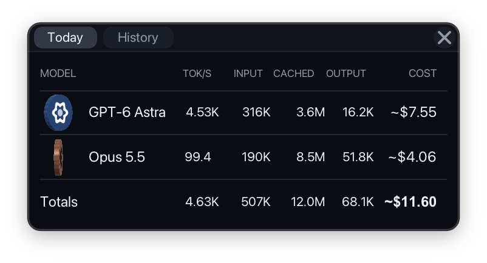
  <ul class="plain-list">
    <li>A tiny toolbar app I leave running <strong>while agents work</strong></li>
    <li>Tokens per second, totals, cache use and rough cost, <strong>per model</strong></li>
    <li>Each model gets a coin that <strong>spins faster as tokens flow</strong></li>
  </ul>
</div>
<p class="small-note">TokenFu · native Metal/Vulkan UI · <a href="https://chrismaughan.com/portfolio/tokenfu/">chrismaughan.com/portfolio/tokenfu</a></p>
```

::: {.notes}
Before the agent rail, a small detour.  TokenFu is a separate little app I wrote to keep an eye on token usage and cost.  It reads the agents' own session logs and shows, per model, tokens per second, input, cached and output tokens, and an estimated cost, with a history view for longer periods.

Each provider gets a small 3D coin, and the coin spins faster as tokens flow.  It turned out to be the most useful part: I could tell at a glance whether anything was actually happening, without reading a number.

So when Draxul needed a way to show agent activity, I ported the coin.  Same colors, same speed scale.  The difference is that in Draxul there's one coin per agent rather than per model, and it sits next to that agent's name.

The figures in the screenshot are from one day of my own use; costs are estimates from public pricing.

Sources: [TokenFu portfolio entry](https://chrismaughan.com/portfolio/tokenfu/).
:::

## Every agent in one list

```{=html}
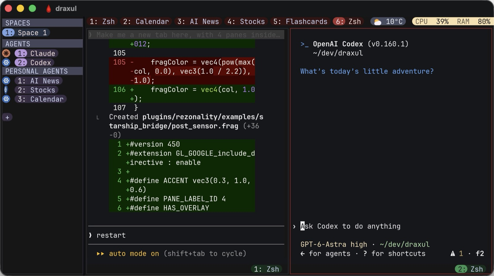
```

::: {.notes}
With four or five agents in different tabs, one would stop to ask a question and I wouldn't notice for twenty minutes.  The rail fixes that.  This is the real rail, on my Mac.  Claude and Codex are running under Agents, with three personal agents below them.

The rail lists Spaces at the top and agents underneath.  Clicking a name activates the owning Space and tab and focuses the pane.  The other agents keep working.

The coin next to each agent is the TokenFu coin.  It's blue for Codex and coral for Claude, and it spins faster as the agent burns tokens, then slows to a stop within a minute of going quiet.  The server gets the rate by tailing the agent's own session log.  Only the rate and total cross the wire, never file paths or text.  An agent waiting for me gets a bright accent; an exited one is dimmed and marked.

The rail picks up agents I launch through Draxul, and also ones I start by hand in an ordinary shell.  Status comes mostly from reading the bottom of the agent's screen, helped by process tracking and optional hooks.  When the rules aren't sure, it says unknown, and `draxul agent explain` shows which rule matched.  Launching is in the command palette: pick a Codex or Claude profile, or one from config.toml.

Sources: [Agents rail in features.md](https://github.com/cmaughan/Draxul/blob/a295e80509c44da3c7b1d6a79468eb60768c587b/docs/features.md); [agent model](https://github.com/cmaughan/Draxul/blob/a295e80509c44da3c7b1d6a79468eb60768c587b/libs/draxul-agent/include/draxul/agent_model.h).
:::

## Agents can use the terminal too

```{=html}
<div class="communication-examples">
  <div class="command-column">
    <h3>Drive a pane</h3>
    <pre><code><span class="cmt"># find it</span>
draxul pane list --json
<span class="cmt"># run something</span>
draxul pane run P --command "ctest"
<span class="cmt"># wait, then read the result</span>
draxul pane wait-output P --text "passed"
draxul pane read P --lines 40</code></pre>
  </div>
  <div class="command-column">
    <h3>Ask another agent</h3>
    <pre><code><span class="cmt"># start a reviewer</span>
draxul agent start claude --cwd .
<span class="cmt"># give it a job</span>
draxul agent prompt A --text "Review it"
<span class="cmt"># wait until it's done or stuck</span>
draxul agent wait A --until done,blocked</code></pre>
  </div>
</div>
<p class="small-note">P and A are IDs from the list commands · <code>--current</code> means “this pane”</p>
```

::: {.notes}
Everything in the UI is also available from the `draxul` command line, talking to the server's local control API.  An agent with shell access can run these just like I can.

On the left: list panes, run a command in one, wait for some text to appear, then read the last 40 lines back.  On the right: start a Claude reviewer, give it a prompt (Enter included), and wait until it's done or blocked.

Each pane gets environment variables telling it which session, space, tab and pane it's in, so an agent can say `--current` instead of working out its own ID.

Two honest caveats.  Done means the agent stopped working, not that it succeeded; you still read its pane.  And `pane read` gives you the bottom of the screen, not a structured answer.

There's more: spaces, tabs, splits, swapping and moving panes, and declarative layouts with `draxul layout apply`.

The control API only listens locally, on a Unix-domain socket or a Windows named pipe, with a per-user token on every request.  Status updates never carry screen text, and destructive commands need `--yes`.  Still, an agent that can type into a shell can do what you can.

Sources: [control codec](https://github.com/cmaughan/Draxul/blob/a295e80509c44da3c7b1d6a79468eb60768c587b/libs/draxul-control/src/control_codec.cpp); [CLI help](https://github.com/cmaughan/Draxul/blob/a295e80509c44da3c7b1d6a79468eb60768c587b/libs/draxul-app-cli/src/cli_help.cpp).
:::

## Skills teach agents the commands

{.deck-visual fig-alt="You ask an agent in plain words; a skill tells it which draxul commands to run; the panes appear."}

::: {.notes}
A skill is a Markdown file of instructions that an agent loads when it needs it.  The `draxul` skill in the repository explains how to find the current session, inspect the layout, apply a layout, run panes, start agents, and wait on them properly.  It also covers the traps, such as not blindly retrying a create command that might already have worked.

So I can say "make me a tab with the build on the left, tests top right, and a reviewer agent bottom right", and the agent does it with `layout apply`, `pane run` and `agent start`.

There are a couple of other skills too.  `draxul-review` asks several different AI models to review the repository and combines the results; `draxul-preflight` checks that their command-line tools are installed and logged in.

Right now these skills live in the Draxul repository, so they're picked up when an agent works there.  Packaging them for use anywhere is still to do.

Sources: [draxul skill](https://github.com/cmaughan/Draxul/blob/a295e80509c44da3c7b1d6a79468eb60768c587b/.agents/skills/draxul/SKILL.md); [skills folder](https://github.com/cmaughan/Draxul/tree/a295e80509c44da3c7b1d6a79468eb60768c587b/.agents/skills).
:::

## Agents keep the Kanban board up to date

```{=html}
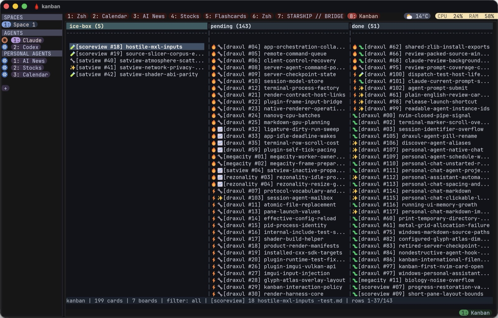
```

::: {.notes}
This is the Kanban board in a Draxul pane.  There's no database behind it: the columns are folders under `kanban/` in the repository, and each card is a Markdown file.  It combines the main repository with its plugin submodules, so SatView, MegaCity, Rezonality and ScoreView cards show up with their own prefix.

The repository's agent instructions do the rest.  Agents are told to create a card in `pending` for any non-trivial new work, tick the checkboxes in the card as they finish each step, and move it to `done` only when everything is ticked.  So the board stays current without me maintaining it.

The board watches the folders, so when an agent edits or moves a card, the pane updates within a fraction of a second.  Enter opens the card in Neovim, and `p` shows a live preview of it.

The icons are priority and type: the fire is P1, the lightning P2, the wrench a refactor, the bug a bug.  In this screenshot there are 143 cards pending and 51 done across seven boards.

Sources: [Kanban in features.md](https://github.com/cmaughan/Draxul/blob/a295e80509c44da3c7b1d6a79468eb60768c587b/docs/features.md); [agent instructions](https://github.com/cmaughan/Draxul/blob/a295e80509c44da3c7b1d6a79468eb60768c587b/AGENTS.md); [CLAUDE.md work items](https://github.com/cmaughan/Draxul/blob/a295e80509c44da3c7b1d6a79468eb60768c587b/CLAUDE.md).
:::

## Personal agents

```{=html}
<div class="personal-agents">
  <div class="pa-rail">
    <div class="rail-heading">PERSONAL AGENTS</div>
    <div class="rail-agent static"><i class="coin codex slow"></i><span class="pill"><b>1</b><span>AI News</span></span></div>
    <div class="rail-agent static"><i class="coin claude"></i><span class="pill"><b>2</b><span>Stocks</span></span></div>
    <div class="rail-agent static"><i class="coin codex"></i><span class="pill"><b>3</b><span>Calendar</span></span></div>
    <div class="pa-add">+</div>
  </div>
  <ul class="plain-list">
    <li>An ordinary Claude or Codex chat <strong>with its own folder</strong></li>
    <li>The folder lives in Dropbox, so <strong>every machine sees it</strong></li>
    <li>Click to pick up where I left off</li>
    <li>Closing the window doesn't stop it</li>
  </ul>
</div>
```

::: {.notes}
This is the newest part, and it's changed shape a few times already.  A personal agent is just an ordinary Codex or Claude conversation with a persistent backing folder.  Press plus, start chatting, and it's there next time.

The folders sit under a shared Dropbox path, set with `[agents].personal_root` in config.toml, so the same agents show up on my Mac and my PC.  Click a pill to return to the conversation; if its terminal has gone, it starts a new one with the same folder.  Deleting moves the folder somewhere recoverable rather than destroying it.

Earlier versions had a definition form and a separate run step.  I took that out; a conversation turned out to be simpler.

Sources: [personal agents documentation](https://github.com/cmaughan/Draxul/blob/a295e80509c44da3c7b1d6a79468eb60768c587b/docs/personal-assistant.md).
:::

## A personal agent at work

```{=html}

```

::: {.notes}
This is one of my personal agents, AI News, open in its own tab.  It keeps a short briefing of recent stories, with links, in the format I asked for.  The rail on the left shows it alongside the Stocks and Calendar agents.

Because it's an ordinary Claude or Codex conversation with its own folder, I can ask follow-up questions in the box at the bottom, or tell it to change the format, and it remembers next time.  Its folder syncs through Dropbox, so the same agent is there on my PC.

The stories in the screenshot are whatever it found that day; the point is the shape of it, not the news.
:::

## Tables and charts, not just text

```{=html}
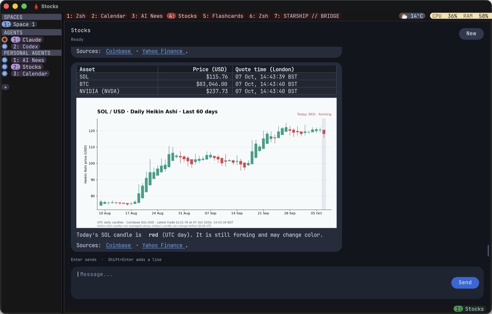
```

::: {.notes}
Another personal agent, Stocks.  I ask it about a few prices and it comes back with a table, a 60-day candle chart, and links to where the numbers came from.

The conversation view renders tables, images and links, not only terminal text, so an agent can answer with whatever fits.  Underneath it's the same kind of personal agent as AI News: a Claude or Codex conversation with its own folder, listed in the rail.

These are just numbers it fetched on the day of the screenshot.
:::

## Next

```{=html}
<ul class="plain-list next-list">
  <li>Inter-agent experiments</li>
  <li>Personal agent improvements</li>
  <li>Network/portable use</li>
  <li>All of the things...</li>
</ul>
<p class="takeaway"><strong>github.com/cmaughan/Draxul</strong></p>
```

::: {.notes}
Inter-agent experiments: agents can already prompt and wait on each other through the command line.  A persistent mailbox between agents is the next step.

Personal agent improvements: they've changed shape a few times already, and there's more to do.

Network/portable use: the client/server split is local today, over Unix-domain sockets and named pipes.  Machine-to-machine transport is listed as future work, and the protocol is what makes it possible.

And all of the things.
:::

## The prompt

```{=html}
<div class="agent-quote prompt-quote">
  <div class="quote-line"><span class="prompt-mark">❯</span> Make me a new tab with a 4-pane seaside scene.  Use rezonality and make the panels 3D, be creative, use full screen effects and geometry/shaders.</div>
  <div class="quote-source">What I typed to an agent in a Draxul pane</div>
</div>
```

::: {.notes}
To finish, one prompt.  This is what I typed to an agent running in Draxul.  From that, the agent made the tab and the four panes and wrote the Rezonality scenes for them: scene graphs, geometry and shaders.
:::

## The result

```{=html}
<video class="rail-shot" src="images/seaside.mp4" poster="images/seaside_poster.jpg" data-autoplay autoplay loop muted playsinline aria-label="A Draxul tab with four Rezonality panes: dawn sea stacks, a midday kelp forest, a sailing boat at sunset, and a lighthouse at night"></video>
```

::: {.notes}
And this is what came back: a new Seaside tab with four 3D Rezonality scenes.  Dawn over sea stacks, a kelp forest at midday, a boat on a broad reach at sunset, and a lighthouse at night.
:::

## Thanks... {.thanks-slide}
