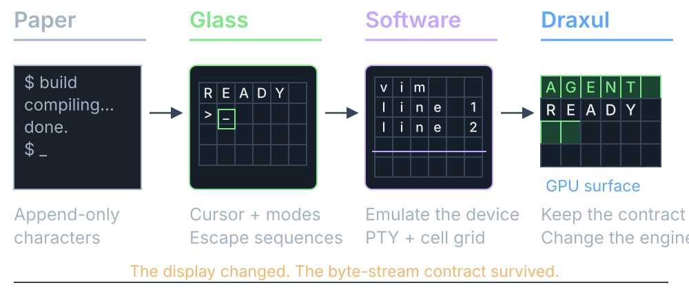
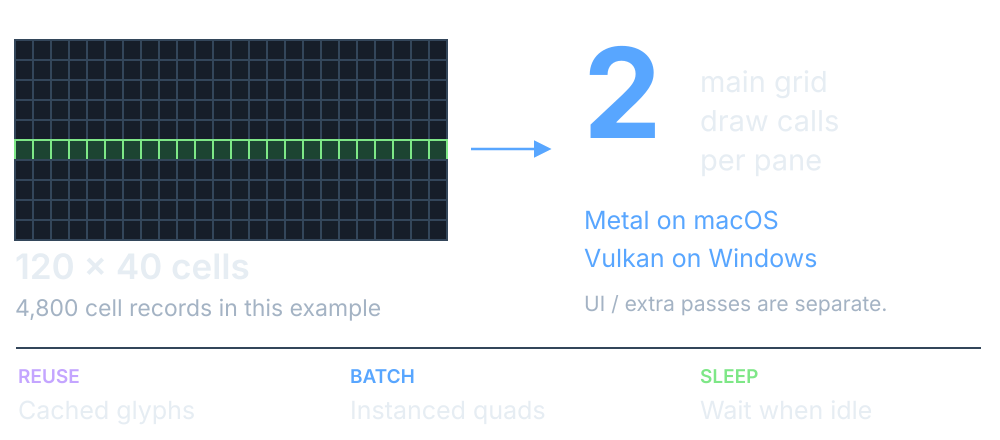
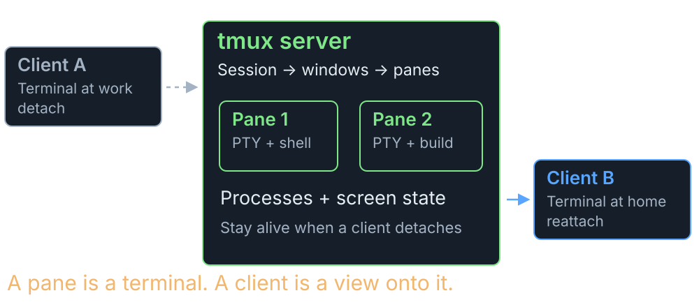
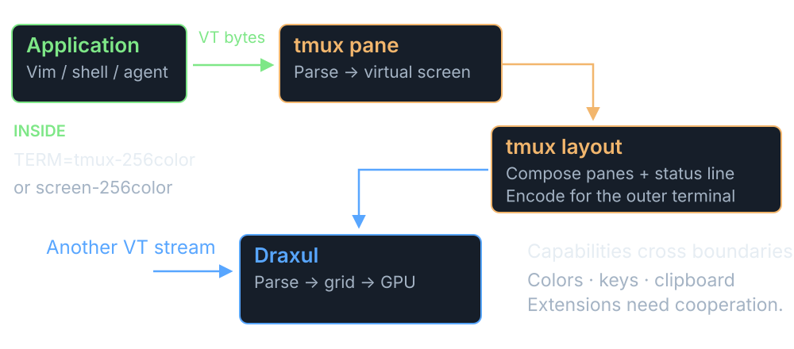

## Building an Agent Friendly Terminal Harness {.title-cover}

```{=html}
<h1>Building an Agent Friendly<br>Terminal Harness</h1>
<p class="cover-meta">Chris Maughan · NVIDIA · Draxul</p>

<div class="cover-bottom"><span>Bytes → cells → glyphs → GPU</span><span>Then keep the agents alive.</span></div>
```

::: {.notes}
I started with a GPU frontend for Neovim.  Hosting shells adds another route into the same rendering machinery, and hosting agents adds another set of lifetime and attention problems.

This is a tour of the terminal substrate first, then the move to persistent sessions and an agent-aware interface.

Implementation reference: Draxul commit `1c369209b5d65cd41226047a18355fffeeee8a8c`.  Historical screenshots may predate the current agent sidebar.

Sources: [Draxul source](https://github.com/cmaughan/Draxul/tree/1c369209b5d65cd41226047a18355fffeeee8a8c); screenshot from `screenshots/terminals_mac_2.png` in the same repository.
:::

## A terminal is an old contract

{.deck-visual fig-alt="History diagram from paper output to addressable screens, software emulators, and a GPU grid"}

<p class="takeaway">The hardware disappeared.  <strong>The compatibility obligations stayed.</strong></p>

::: {.notes}
Early terminals sent characters to a host and printed its output.  Video terminals added an addressable screen, cursor movement, modes, and control sequences.  Software emulators inherited those behaviors so existing applications could keep working.

VT100 and later DEC terminals, ANSI/ECMA control syntax, and xterm extensions are overlapping parts of that inheritance.  Calling everything “ANSI” is convenient, but hides the dialects.  A modern GPU terminal can radically change how pixels are drawn while keeping that older contract with applications.

The illustrations are a conceptual progression, not photographs or exact models of historical hardware.

Sources: [DEC VT100 user guide](https://vt100.net/docs/vt100-ug/); [xterm control sequences](https://invisible-island.net/xterm/ctlseqs/ctlseqs.html).
:::

## Two ways into Draxul’s grid

{.deck-visual fig-alt="Shells use PTY and the server VT core; embedded Neovim uses RPC redraw events; both feed text and GPU rendering"}

<p class="takeaway">Shells send a terminal stream.  <strong>Neovim can send structured redraw events.</strong></p>

::: {.notes}
The shell path is PTY on macOS and ConPTY on Windows.  Draxul's terminal core decodes the stream into cell contents, attributes, modes, and cursor state.  In the current architecture the server owns that terminal state; the UI receives semantic snapshots and deltas.

Embedded Neovim follows a different path: msgpack-RPC and ext_linegrid redraw events.  It already knows its screen layout.  That integration remains client-local, even when its pane is represented in shared topology.

Both paths reach the grid/text/rendering infrastructure.  The renderer sees geometry, colors, atlas coordinates, and flags.  It does not need to understand Bash, PowerShell, VT syntax, or Neovim RPC.

Sources: [module map](https://github.com/cmaughan/Draxul/blob/1c369209b5d65cd41226047a18355fffeeee8a8c/docs/module-map.md); [runtime ownership design](https://github.com/cmaughan/Draxul/blob/1c369209b5d65cd41226047a18355fffeeee8a8c/plans/server-client-terminal-runtime.md).
:::

## PTY carries the conversation

{.deck-visual fig-alt="Bidirectional PTY or ConPTY connection carrying output, keyboard input, and terminal replies, with platform-specific resize APIs"}

<p class="takeaway"><strong>PTY is the connection.</strong>  VT escape sequences are the language.</p>

::: {.notes}
A pseudoterminal gives the shell terminal semantics, rather than just an ordinary pipe.  On macOS the PTY has master/slave endpoints, termios settings, terminal size, and signal behavior.  The terminal application reads output and writes encoded input through its side of the connection.

Windows ConPTY offers a similar hosting boundary using UTF-8 and VT sequences.  It can translate legacy console API activity into terminal output.  Resizing uses platform APIs, rather than being an ordinary printable character in the stream.

This is bidirectional even when no one types.  An application can request the cursor position with CSI 6 n; Draxul must write the reply back.  Input encoding also depends on application cursor mode, mouse tracking, focus reporting, and bracketed paste.

Sources: [Apple openpty/forkpty](https://developer.apple.com/library/archive/documentation/System/Conceptual/ManPages_iPhoneOS/man3/openpty.3.html); [Microsoft pseudoconsoles](https://learn.microsoft.com/en-us/windows/console/pseudoconsoles); [Draxul process adapters](https://github.com/cmaughan/Draxul/tree/1c369209b5d65cd41226047a18355fffeeee8a8c/libs/draxul-terminal-process).
:::

## The protocol has dialects

```{=html}
<div class="opcode" aria-label="ESC bracket introduces CSI, question mark selects a private mode, 1049 identifies alternate screen behavior, and h enables it">
  <div class="blue"><code>ESC [</code><span>CSI introducer</span></div>
  <div class="purple"><code>?</code><span>private marker</span></div>
  <div class="orange"><code>1049</code><span>mode number</span></div>
  <div class="green"><code>h</code><span>set mode</span></div>
  <div class="opcode-explanation">Enter the<br><strong>alternate screen</strong></div>
</div>
<div class="protocol-map">
  <div>
    <div class="dialect"><strong>CSI</strong><span>cursor · erase · colors · modes</span></div>
    <div class="dialect"><strong>OSC</strong><span>title · links · clipboard · shell marks</span></div>
    <div class="dialect"><strong>DCS</strong><span>device strings · capability queries</span></div>
  </div>
  <div class="protocol-counts">
    <div><strong>30</strong><span>CSI final bytes<br>dispatched by Draxul</span></div>
    <div><strong>14</strong><span>DEC private-mode<br>numbers handled</span></div>
  </div>
</div>
<p class="protocol-summary">DEC → xterm → emulator extensions.  <span class="orange">Same grammar; different coverage.</span></p>
<p class="small-note">Source counts at Draxul 1c369209.  These are dispatch counts, not a complete command count or a conformance claim.</p>
```

::: {.notes}
There is no useful universal answer to “how many terminal opcodes do I need?”  A final byte does not identify an operation on its own.  Private markers, intermediate bytes, parameter values, and existing modes all matter.  SGR alone uses the same final m for resets, styles, indexed colors, and RGB colors.

In the inspected code, handle_csi dispatches 30 distinct final characters.  csi_mode handles 14 distinct DEC private-mode numbers, including three alternate-screen aliases.  Those are not 44 independent commands.  There are also six recognized OSC selectors—0, 2, 7, 8, 52, and 133—plus C0/ESC handling.  The DCS path recognizes XTGETTCAP queries and returns an unsupported response rather than leaving a caller waiting.

The practical target is the applications you need: a shell prompt, a full-screen editor, terminal agents, and multiplexers exercise different subsets.  TERM/terminfo and device replies advertise capabilities; they do not magically implement them.  In xterm, 1049 includes save/restore and alternate-screen behavior; Draxul currently routes 47, 1047, and 1049 through shared alternate-screen handling.

Sources: [Draxul CSI/OSC/DCS dispatch](https://github.com/cmaughan/Draxul/blob/1c369209b5d65cd41226047a18355fffeeee8a8c/libs/draxul-terminal-core/src/terminal_core_csi.cpp); [xterm control sequences](https://invisible-island.net/xterm/ctlseqs/ctlseqs.html); [Microsoft VT sequences](https://learn.microsoft.com/en-us/windows/console/console-virtual-terminal-sequences).
:::

## Bytes arrive in inconvenient pieces

{.deck-visual fig-alt="A color escape sequence split across two reads is retained through Ground, Escape, CSI and Dispatch states before red Hi is written to cells"}

<p class="takeaway">Decode incrementally.  <strong>Mutate terminal state before thinking about pixels.</strong></p>

::: {.notes}
Here the first read ends after ESC [ 3 1.  There is no complete command yet.  The next read begins with m, completing the foreground-red command.  H and i become cell content under the current attributes; ESC [ 0 m resets the attributes for subsequent text.

The diagram shows a simplified CSI route, not every parser state.  Draxul's parser has nine enum states covering ground, escape, CSI, OSC, DCS, string termination, and ignored overlong DCS data.  Printable text has a separate UTF-8/cluster path.  UTF-8 code points can also straddle read boundaries.

The parser dispatches callbacks; TerminalCore owns the terminal behavior.  Buffers are capped: CSI at 4 KiB, OSC and DCS at 8 KiB, and plain-text accumulation at 64 KiB.  Bounds and recovery matter because the child process controls this input.  Cross-read grapheme-cluster handling still has tracked hardening work; do not interpret the simplified picture as full Unicode conformance.

Sources: [parser contract](https://github.com/cmaughan/Draxul/blob/1c369209b5d65cd41226047a18355fffeeee8a8c/libs/draxul-terminal-core/include/draxul/vt_parser.h); [parser implementation](https://github.com/cmaughan/Draxul/blob/1c369209b5d65cd41226047a18355fffeeee8a8c/libs/draxul-terminal-core/src/vt_parser.cpp).
:::

## A character is not a glyph

{.deck-visual fig-alt="Two Unicode code points form one accented display cluster; the rendering pipeline separates cell width, shaping, rasterization and texture caching"}

<p class="takeaway"><strong>HarfBuzz shapes.  FreeType rasterizes.</strong>  The terminal still owns the cell layout.</p>

::: {.notes}
An ASCII letter makes this look trivial.  An e followed by a combining acute accent is two code points but can occupy one display cluster and one terminal cell.  Wide characters, emoji sequences, font fallback, and programming ligatures break the one-byte/one-character/one-glyph intuition in different ways.

Draxul decodes and stores display text with grid attributes.  Font selection and fallback choose the face.  HarfBuzz returns glyph IDs and offsets; FreeType produces glyph bitmaps; the cache packs reusable pixels into the atlas.  The grid still constrains placement.  The pipeline diagram compresses several collaborating classes and cache checks into their conceptual stages.

The renderer ultimately gets texture coordinates and dimensions, not a Unicode character that the GPU magically understands.  Some box-drawing glyphs also have a dedicated path so adjoining cells meet cleanly.

Sources: [text shaping](https://github.com/cmaughan/Draxul/blob/1c369209b5d65cd41226047a18355fffeeee8a8c/libs/draxul-font/src/text_shaper.cpp); [glyph cache](https://github.com/cmaughan/Draxul/blob/1c369209b5d65cd41226047a18355fffeeee8a8c/libs/draxul-font/src/glyph_cache.cpp); [font service](https://github.com/cmaughan/Draxul/tree/1c369209b5d65cd41226047a18355fffeeee8a8c/libs/draxul-font).
:::

## The GPU sees a grid of quads

{.deck-visual fig-alt="An exploded rendering diagram shows grid records feeding one background pass and one atlas-textured glyph pass"}

<p class="takeaway">Two main passes: <strong>opaque backgrounds, then alpha-blended glyphs.</strong></p>

::: {.notes}
Each GpuCell record is 112 bytes in the inspected implementation, with a compile-time size assertion.  It carries pixel position, cell size, background/foreground/special colors, atlas UVs, glyph offset/size, and style flags.

The vertex shader generates quad geometry using instance and vertex indices.  The first grid draw paints cell backgrounds.  The second paints glyphs from the atlas with alpha blending.  Draxul batches grid work; it does not issue a draw call for every character.

Metal uses shared buffers on macOS; Vulkan uses host-visible memory on Windows.  Atlas uploads, buffer synchronization, pane clipping, cursor overlays, and UI rendering still need management.  The atlas shown here is schematic, not a dump of the real packed texture.

Sources: [GpuCell layout](https://github.com/cmaughan/Draxul/blob/1c369209b5d65cd41226047a18355fffeeee8a8c/libs/draxul-renderer/include/draxul/renderer_state.h); [Metal draw path](https://github.com/cmaughan/Draxul/blob/1c369209b5d65cd41226047a18355fffeeee8a8c/libs/draxul-renderer/src/metal/metal_renderer.mm); [Vulkan renderer](https://github.com/cmaughan/Draxul/blob/1c369209b5d65cd41226047a18355fffeeee8a8c/libs/draxul-renderer/src/vulkan/vk_renderer.cpp).
:::

## Spend the work once.  Reuse it

{.deck-visual fig-alt="An illustrative 120 by 40 cell pane uses two main grid draw calls, with cached glyphs, instancing and event-driven idle waiting"}

<p class="takeaway"><strong>Less submission overhead.  Reused glyph pixels.</strong>  More room for multiple live panes.</p>

::: {.notes}
A 120 by 40 pane contains 4,800 cells.  That is an illustrative workload, not a measurement from the screenshot.  Draxul's main grid path uses two instanced draws per pane: backgrounds and glyphs.  It may also draw UI, plugins, and other passes, so “two draws” is not the total frame cost.

The benefit is avoiding per-character draw submission, reusing cached glyph pixels, and letting the GPU rasterize and blend many quads efficiently.  Dirty tracking reduces CPU-side preparation and buffer-update work; it does not mean every frame draws only dirty pixels.  Idle clients wait for events or scheduled deadlines, including cursor and animation updates.

GPU acceleration does not eliminate UTF-8 decoding, VT parsing, shaping, scrollback maintenance, synchronization, or IPC.  I would measure these independently before claiming a speedup.  This slide deliberately makes no FPS or comparative performance claim.

Sources: [renderer state and dirty ranges](https://github.com/cmaughan/Draxul/blob/1c369209b5d65cd41226047a18355fffeeee8a8c/libs/draxul-renderer/src/renderer_state.cpp); [event-driven application loop](https://github.com/cmaughan/Draxul/blob/1c369209b5d65cd41226047a18355fffeeee8a8c/app/app.cpp).
:::

## The difficult part is the state

{.deck-visual fig-alt="A small terminal screen is surrounded by interacting resize, scrollback, Unicode, input mode, timing and recovery concerns"}

<p class="takeaway">A fast renderer helps.  <strong>Correctness lives around it.</strong></p>

::: {.notes}
The hard bugs often combine features that work separately.  Resize during a full-screen redraw.  Paste while bracketed-paste mode is enabled.  Move between normal and alternate screens.  Put a wide cluster at the right margin.  Let a reply-generating query arrive in the middle of a burst.

Terminal modes persist until changed.  Scroll margins, pending wrap, cursor visibility, mouse coordinates, and selection all need coherent behavior.  An application can also hide the cursor during an update or request synchronized output.

Draxul's tests cover partial VT sequences, SGR, OSC/ESC, mouse input, PSReadLine behavior, terminal snapshots, atlas resets, and transport behavior.  The repository still tracks hardening and performance work.  The point is to communicate the interaction surface, not claim the terminal is finished.

Sources: [terminal core](https://github.com/cmaughan/Draxul/tree/1c369209b5d65cd41226047a18355fffeeee8a8c/libs/draxul-terminal-core); [tests](https://github.com/cmaughan/Draxul/tree/1c369209b5d65cd41226047a18355fffeeee8a8c/tests); [active work](https://github.com/cmaughan/Draxul/tree/1c369209b5d65cd41226047a18355fffeeee8a8c/kanban/pending).
:::

## tmux: keep the session alive

{.deck-visual fig-alt="A persistent tmux server keeps pane processes alive while one terminal client detaches and another attaches"}

<p class="takeaway"><strong>Detach the view.</strong>  Keep the shells, programs, and pane state running.</p>

::: {.notes}
A tmux server owns sessions, windows, panes, and the programs inside those panes.  Terminal clients attach to it.  Detaching a client leaves the server and its programs alive, so a dropped connection does not have to end the work.

A session can contain several windows; a window can contain multiple panes.  Multiple clients can connect.  These concepts provide a useful ownership model for long-running agent work as well as ordinary shells.

Persistence here means live processes survive client detachment while their server remains alive.  It is not a guarantee that a process survives a server crash or machine restart.

Source: [tmux getting started — server, clients, sessions, windows and panes](https://github.com/tmux/tmux/wiki/Getting-Started).
:::

## tmux is another terminal in the middle

{.deck-visual fig-alt="Application VT output enters a tmux virtual screen, which is composed and re-encoded for Draxul's outer terminal"}

<p class="takeaway">In normal mode, <strong>the stream is interpreted twice.</strong>  Capabilities must survive both layers.</p>

::: {.notes}
In normal attached mode, tmux interprets application output into its own pane screens, combines those screens with its status line, and emits sequences appropriate for the outer terminal.  Draxul then interprets that stream and renders its own grid.

The application inside tmux typically sees a tmux-256color or screen-256color terminal description.  The outer terminal has its own capabilities.  That boundary explains why a color, key, clipboard, or graphics extension may behave differently inside a multiplexer.  Support and, in some cases, explicit passthrough are needed across the relevant layers.

There is also tmux control mode, a structured interface for clients integrating with tmux.  The diagram describes ordinary terminal mode and should not be read as the only possible integration architecture.

Sources: [tmux manual](https://man.openbsd.org/tmux); [tmux control mode](https://github.com/tmux/tmux/wiki/Control-Mode).
:::

## Move ownership out of the window

{.deck-visual fig-alt="Draxul's evolution from a single process to a headless server owning shells and state, with independent GPU clients"}

<p class="takeaway">Closing Draxul’s UI should <strong>close a view, while the work continues.</strong></p>

::: {.notes}
This is the architectural change from an in-process shell emulator to the current persistent shell runtime.  Extracting a renderer-free terminal core allows the server to parse output and maintain terminal state with no GPU window attached.

The server owns PTY/ConPTY processes, terminal state, scrollback, shared topology, agent state, and session persistence.  The client owns fonts, rendering, window geometry, selection, viewport, and local focus.  One server can serve several GPU clients.

This is more than moving a read loop to another process: lifetime, authority, IDs, thread ownership, and failure behavior all need explicit contracts.  Neovim and product/plugin runtimes remain client-local where designed; they do not automatically inherit persistent shell semantics.

A UI reconnect preserves running shells because the server still owns them.  A cold server restart is a different operation: restore topology and relaunch according to policy.  It cannot resurrect a dead process.

Sources: [server/client runtime design](https://github.com/cmaughan/Draxul/blob/1c369209b5d65cd41226047a18355fffeeee8a8c/plans/server-client-terminal-runtime.md); [current module boundaries](https://github.com/cmaughan/Draxul/blob/1c369209b5d65cd41226047a18355fffeeee8a8c/docs/module-map.md).
:::

## Reconnect to state, not old output

{.deck-visual fig-alt="Client/server sequence diagram showing version negotiation, a semantic snapshot, ordered deltas, controller-lease input and resnapshot recovery"}

<p class="takeaway"><strong>One authoritative terminal.</strong>  Independent clients, bounded delivery, explicit recovery.</p>

::: {.notes}
Replaying a byte log is a poor substitute for current state: an unattached terminal can change modes, scroll, enter the alternate screen, or query the terminal.  The server must continue interpreting and answering while no UI is attached.

Draxul's protocol sends semantic snapshots and deltas.  Cells, attributes, cursor state, modes, and revisions cross the connection; font handles, glyph-atlas coordinates, and GPU buffers stay in the UI.  The client can render at its own DPI without imposing a GPU dependency on the server.

Current delivery prefers a shared session stream with a batched polling fallback.  Epochs, revisions, and recovery rules detect stale or missing state.  A controller lease gives one client responsibility for a terminal's input and resize; other clients can observe or explicitly take over.  Per-client bounds prevent a slow UI from blocking the terminal runtime.

This is authenticated local IPC over Unix-domain sockets on macOS and named pipes on Windows.  The diagram is a conceptual sequence, not literal packet names.  SSH transport is outside this local implementation.

Sources: [protocol library](https://github.com/cmaughan/Draxul/tree/1c369209b5d65cd41226047a18355fffeeee8a8c/libs/draxul-protocol); [client library](https://github.com/cmaughan/Draxul/tree/1c369209b5d65cd41226047a18355fffeeee8a8c/libs/draxul-client); [server runtime design](https://github.com/cmaughan/Draxul/blob/1c369209b5d65cd41226047a18355fffeeee8a8c/plans/server-client-terminal-runtime.md).
:::

## Herdr: make agent state visible

{.deck-visual fig-alt="Conceptual Herdr interface with spaces, panes, and working, blocked and done agent indicators"}

<p class="takeaway">The appeal: <strong>less pane hunting, familiar tools, and work that survives detaching.</strong></p>
<p class="small-note">Conceptual interface diagram.  Herdr is a separate project: <a href="https://herdr.dev">herdr.dev</a>.</p>

::: {.notes}
Herdr is an agent-aware terminal multiplexer/runtime.  It groups work into spaces, tabs, and panes, recognizes agent processes, and exposes working, blocked, done, idle, or unknown states.  Its CLI and local control API let scripts and agents operate the environment as well as humans.

The useful design idea for Draxul is combining process persistence with attention: tell me which agent needs a response, then take me to its pane.  That explains the appeal without needing a popularity claim or a feature-count contest.

State recognition combines process identity with integrations and terminal-screen rules.  Complete lifecycle hooks can be authoritative; a native conversation/session ID alone does not prove whether an agent is working.  Screen heuristics can drift, so unknown and explainable evidence matter.

This is a conceptual interface diagram, not a Herdr screenshot or a claim that Draxul runs Herdr internally.  The project is motionharvest/herdr, also identified by Draxul's existing research notes.

Sources: [Herdr documentation](https://herdr.dev/docs/); [agent detection and state](https://herdr.dev/docs/agents/); [Draxul's Herdr research](https://github.com/cmaughan/Draxul/blob/1c369209b5d65cd41226047a18355fffeeee8a8c/plans/herdr-agent-harness-research.md).
:::

## An agent panel that takes me to the work

```{=html}
<div class="agent-demo" aria-label="Interactive conceptual Draxul agent panel">
  <div class="agent-list">
    <div class="demo-heading">AGENTS · CLICK TO HOP</div>
    <button class="agent-row" data-agent="build" aria-pressed="false"><span class="green">●</span> Build renderer<small>Running · working · managed</small></button>
    <button class="agent-row active" data-agent="review" aria-pressed="true"><span class="orange">◆</span> Review protocol<small>Running · blocked · discovered</small></button>
    <button class="agent-row" data-agent="tests" aria-pressed="false"><span class="blue">✓</span> Test reconnect<small>Running · done · managed</small></button>
    <button class="agent-row" data-agent="new" aria-pressed="false"><span class="purple">○</span> New investigation<small>Created → starting · managed</small></button>
  </div>
  <div class="agent-pane" aria-live="polite" aria-atomic="true">
    <div class="demo-route" id="agent-route">Draxul / Protocol / pane 2</div>
    <h3 id="agent-title">Review protocol</h3>
    <div class="demo-status" id="agent-status">Blocked · needs a decision</div>
    <pre id="agent-output">Found a resize / controller race.

Keep the lease until acknowledgement?

› Waiting for your input…</pre>
  </div>
</div>
<p class="agent-pipeline">Create or discover → stable identity → observed state → sidebar → Space / Tab / Pane</p>
<p class="takeaway"><strong>Running ≠ working.</strong>  Clicking changes my focus; the other agents keep going.</p>
<p class="small-note">Interactive concept using illustrative tasks and output.  Current Draxul model separates lifecycle, semantic status, and identity.</p>
```

::: {.notes}
Click the four rows during the presentation.  The panel demonstrates navigating to the owning Space, Tab, and Pane without restarting work.  The task names and terminal output are illustrative; this is not a live Draxul connection.

Draxul separates durable identity from runtime lifecycle and semantic status.  Lifecycle is Starting, Running, Exited, or Failed.  Semantic status is Unknown, Idle, Working, Blocked, or Done.  “Created” in this illustration is the user's creation event, represented by Starting; it is not an extra enum state.  A Running agent can be blocked on a decision or done with its latest task while the process stays alive.

Managed agents are launched intentionally; discovered agents may have been started by hand in an ordinary shell pane.  Both need stable identity and a route to their owner.  The sidebar is a projection of authoritative state, not a second independent registry.  Process discovery, screen evidence, and integrations contribute different kinds of evidence.

AgentController already provides identity-based and index-based focus operations.  The route activates the Space and Tab and focuses the owning pane.  Local navigation must not drag another UI client to the same pane.  The design goal is to spend less time looking for the waiting agent.

Sources: [agent identity, lifecycle and status model](https://github.com/cmaughan/Draxul/blob/1c369209b5d65cd41226047a18355fffeeee8a8c/libs/draxul-agent/include/draxul/agent_model.h); [agent controller and focus routing](https://github.com/cmaughan/Draxul/blob/1c369209b5d65cd41226047a18355fffeeee8a8c/app/agent_controller.cpp); [agent UI design](https://github.com/cmaughan/Draxul/blob/1c369209b5d65cd41226047a18355fffeeee8a8c/plans/agent-cards-token-activity.md).
:::
